## RCAST 39: KNOTS AS PROCESSES

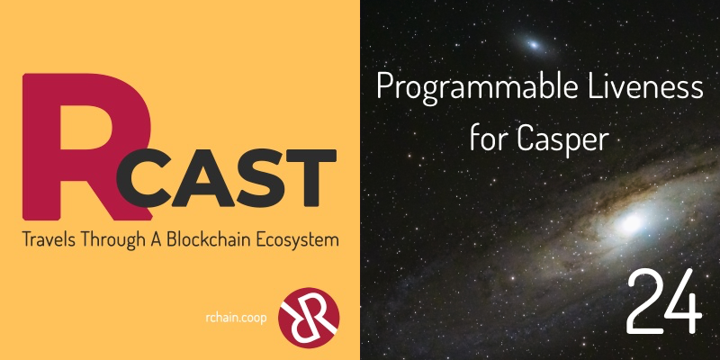

https://soundcloud.com/rchain-cooperative/rcast-24-programmable-liveness-for-casper

Greg Meredith is joined by Isaac DeFrain and Christian Williams to discuss RChain research on Casper. The slides and transcript are below.

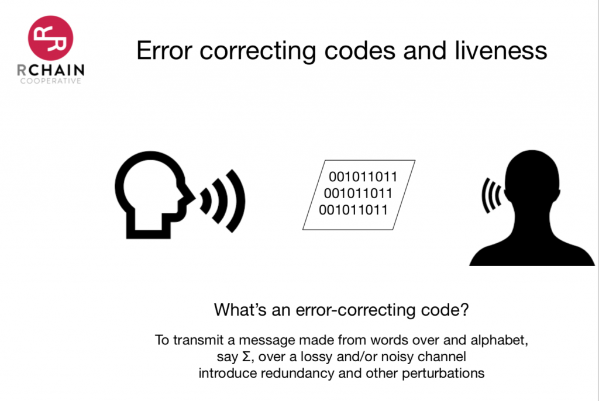
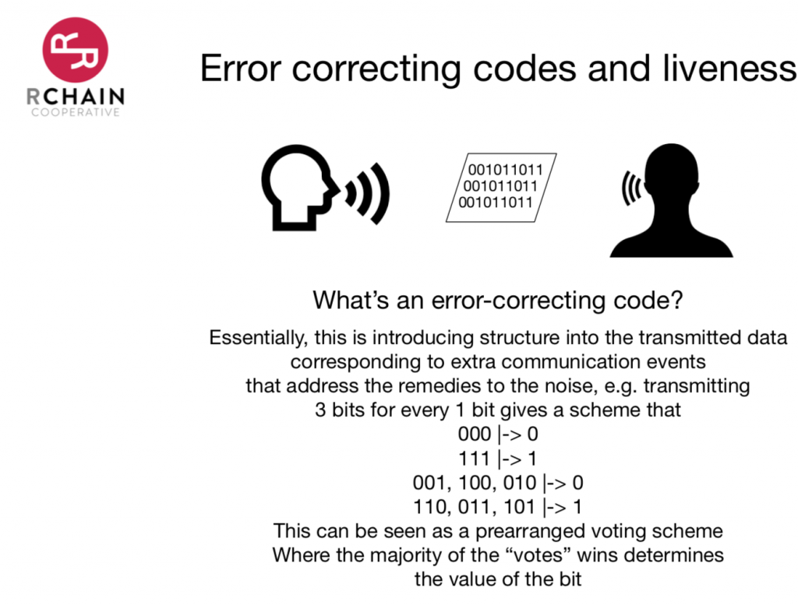
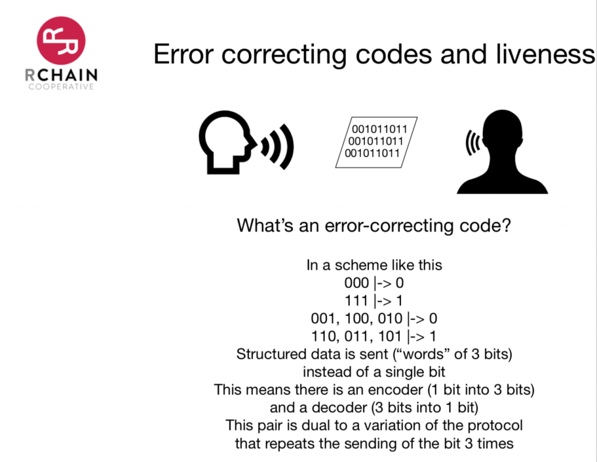
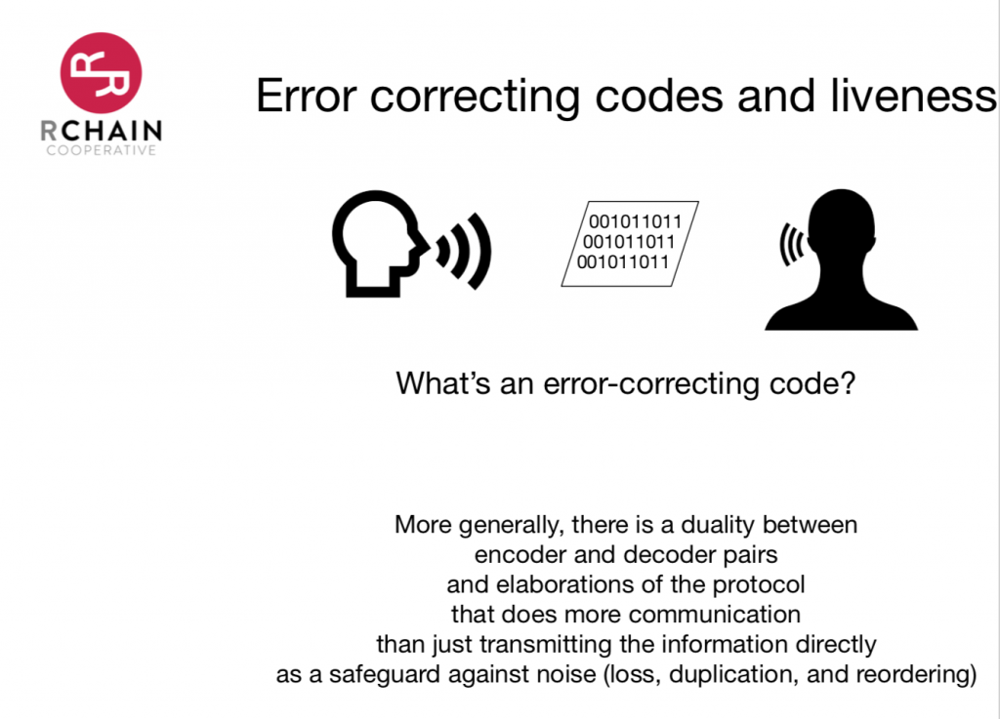
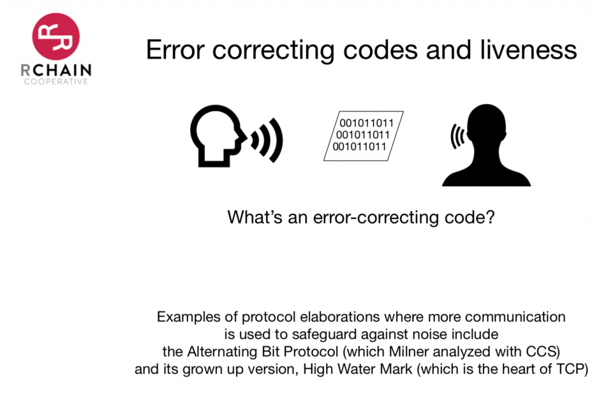
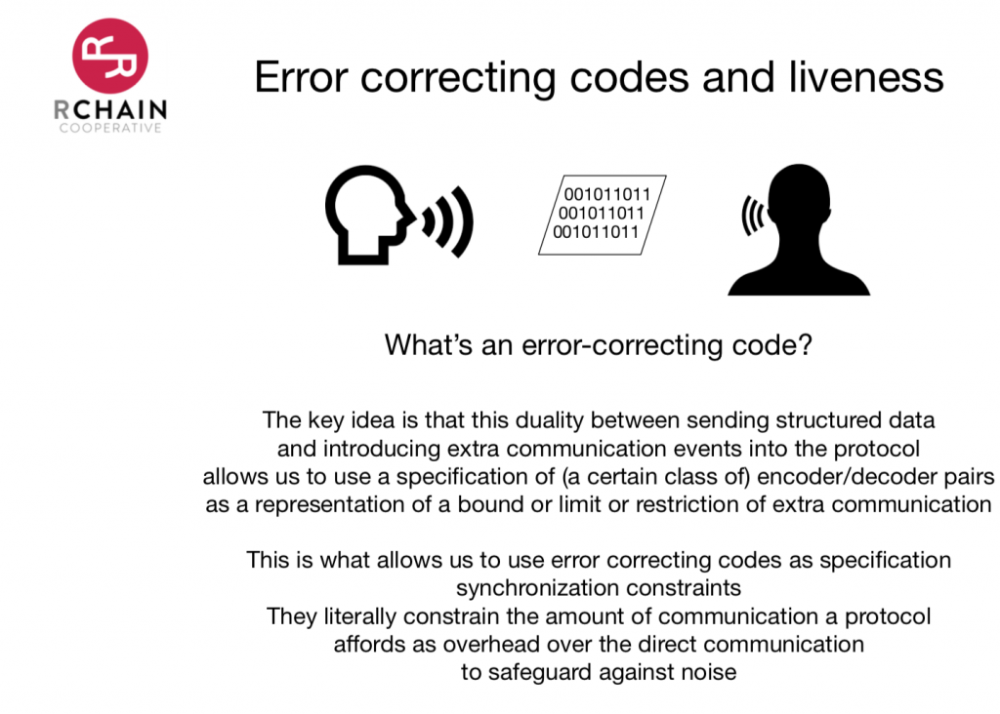
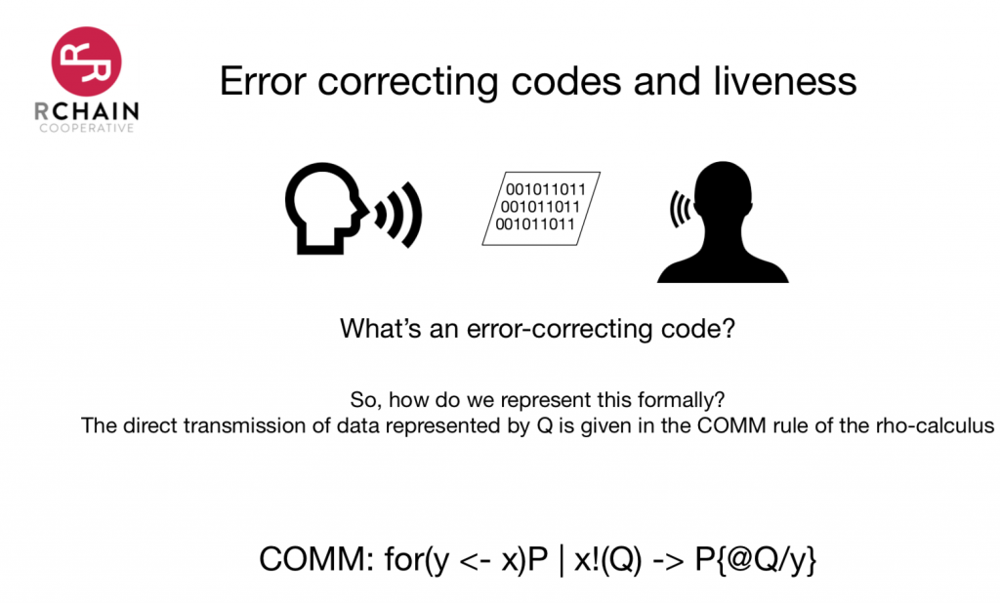
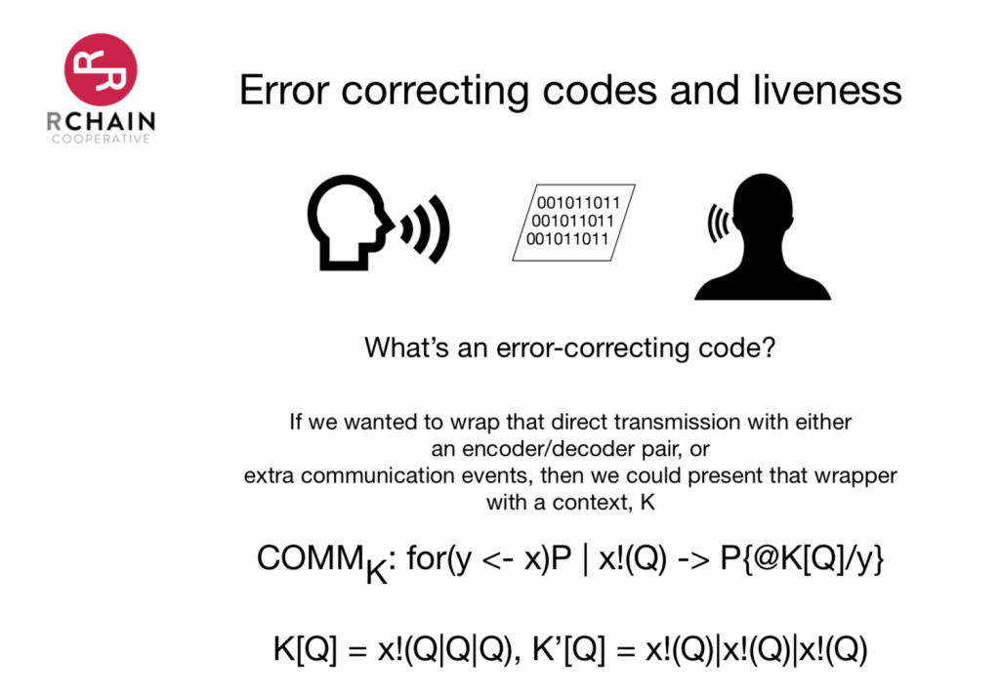
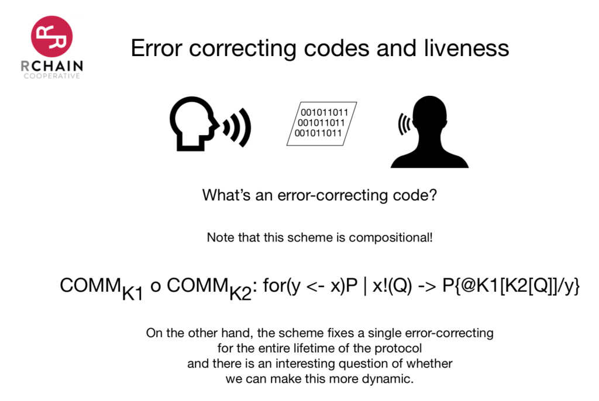
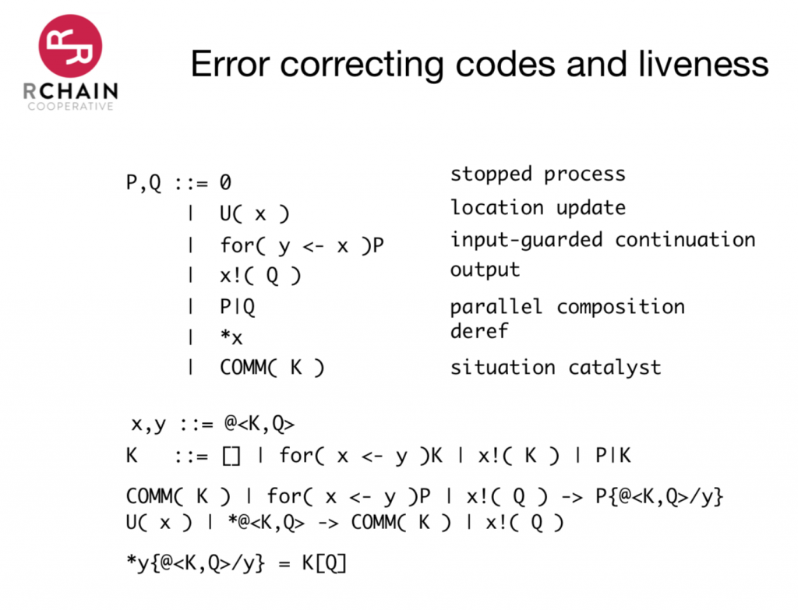
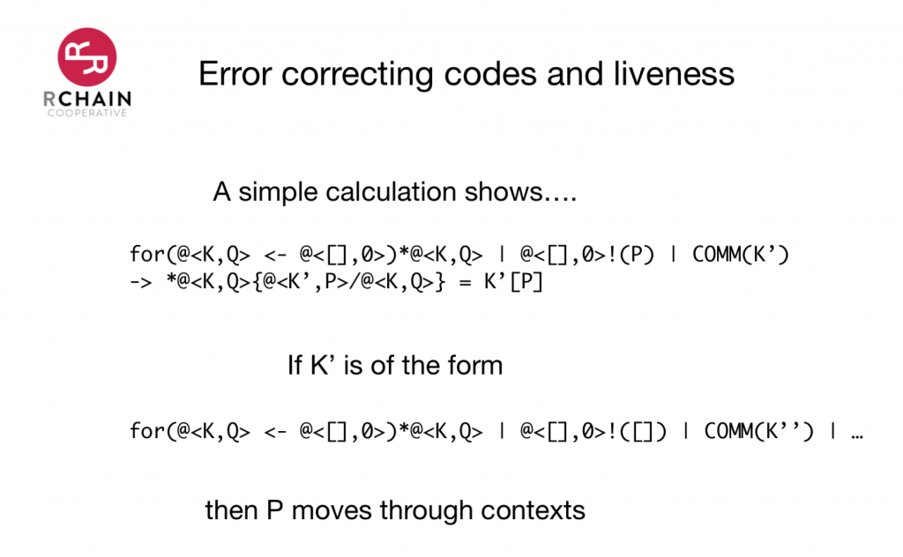
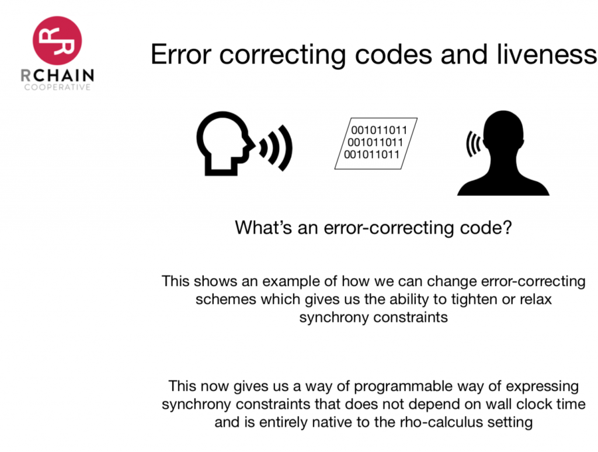
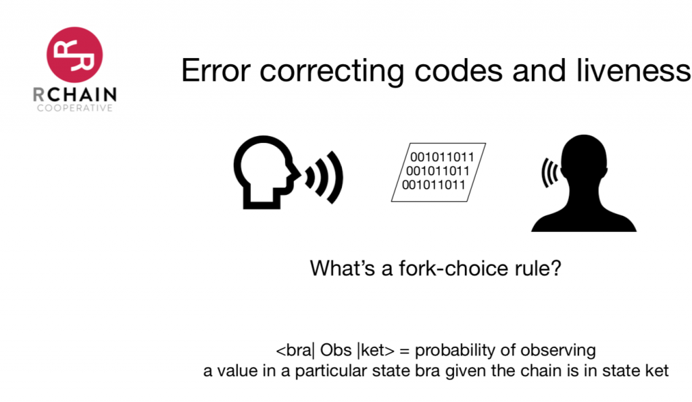

### TRANSCRIPT

Greg: Today we’re going to talk about RChain research in the Casper direction—an application of Rho calculus. We’ll talk about an extension of the Rho calculus. In 2008, I was driving from Seattle to Vancouver when I saw the domain equation that would describe the calculus. It took me another year or so to write the equation down. Then it took me another 10 years to write down the calculus that corresponded to the solution to the equation. Here’s an application for the equation that I think is kind of cool.

A lot of consensus algorithms have to deal in the end with something called FLP impossibility. Essentially what they proved is only asynchronous communication, then it’s impossible for autonomous agents to come to agreement. They end up always being this kind of bifurcated state where some chunk of them believes the value that they’re operating with is one thing, and another chunk believes that the value that they’re converging to is another thing.

If you want to get around this inevitability of a fork is to impose some synchrony constraints. When you’re thinking about synchrony constraints, these need to be limits on something, with respect to the communication amongst the participants. You could say there’s some time-bound on the communication events. There’s some number—and you don’t even have to know the number—of taking seconds that they bounce the communication events. That’s one approach.

Isaac: That’s why they did in Cassanova, right?

Greg: That’s correct. Now the problem with a wall clock time, like synchronization constraints, is you’ve now introduced another area of trust. Because network time is nontrivial, trying to get a decentralized network time rolled out is not exactly easy. It gets much more difficult in an age of satellites, where you begin to experience relativistic effects between the ground and the satellite. There’s an actual relativistic correction that goes on in communications with satellites and the ground these days.

That’s a lot to take on if you want to roll out a protocol globally. It would be better if we could have a way of putting some synchronization constraints that didn’t involve wall clock time at all. If you could somehow get something intrinsic to the communication events themselves that allowed you to introduce these synchronization constraints, that would be cool.

I realized that we could describe a wide range of synchronization constraints using polynomials. These were polynomials that were effectively a sub-class or a sub-algebra of the Rho calculus. Every term in a polynomial represented that a communication event had occurred by one of the participating parties. We didn’t say whether it was a send or receive, just that a communication had occurred. Multiplication was sequencing and sum was choice in non-determinism.

Any particular multiplication of terms for the validator set represents round robin. So V1 x V2 x V3 all the way up to VN. That includes all of the validators is effectively one path from V1 to VN. You can get to round robin in this style. When I was thinking about these polynomials, I noticed two things.

One, that I could encode them readily directly in the Rho calculus. Two, they reminded me of the kinds of polynomials that show up in error-correcting codes. I did a literature search and discovered about 10 years ago some folks had figured out that error-correcting codes give you synchronization constraints and can be used to enforce likeness, enforce a termination of a consensus protocol. That’s already a part of the literature. I can give you a rough idea of what’s going on there before we dive into some of the other stuff. Let me just stop and check in and see if what I’ve said makes sense.

Christian: Yeah, this makes sense. The necessity of imposing synchrony constraints, if you imagine a bunch of people who can only communicate by leaving things in mailboxes, they would certainly have a hard time reaching an agreement on unless they are coordinating. It’s really cool that there’s this correspondence with polynomials. I don’t yet know how to think about it in detail.

Greg: Basically it’s just like going back to CCS. It’s the same sort of intuitions that ultimately Milner built on in order to give CCS. It’s really just looking at a tightly constrained subset of what you can do with Rho.

The basic idea of error-correcting codes goes way back to long before CCS or Pi calculus or any of those things were discovered. You’re trying to get a message; let’s keep it simple for our intuitions. Just from one party to another over a channel that’s noisy. The noise represents the possibility of either dropping the information that’s being transmitted—just losing it entirely—or duplicating the information, or potentially reordering the information.

Suppose that you’re just transmitting bits; so you’re just transmitting as zeros and ones. We know that there’s a kind of correlation between sending structured information and sending atomic information, like a bit. Obviously, there’s a kind of duality between sending structured data and doing a lot of communication events of sending atomic data. If I were going to send a word of bits, what would I do? I’d send one bit and the next bit and the next bit. Then someone on the other end would have to assemble that data into the structure. This is just like sending packets over TCP today. It’s not a complex idea. If I want to send something that’s larger than a packet, I have to break it up into packets, send the packets, and reassemble it. Very simple idea.

Christian: Would that change in the Rho calculus because you can package up large amounts of code as a name and send it all at once? Or does it down in the hardware eventually just translate back down into packets?

Greg: There are actually two questions in your question. If we’re talking about the theoretical realm, in the Rho calculus, one of the things that we can do is we could express this duality. We could imagine that there’s an atomic thing, which there is in the Rho calculus, and we could prove quite rigorously, in fact, that any structure that was encoded in a name could be sent. There’s a one send communication event that sends the structure over. Then there’s a bunch of communications that would send the information in atomic chunks, or package chunks, so to speak. Does that make sense?

Christian: I think so.

Greg: Cool. There’s a theorem there that I would invite people to go and try to improve. It might be conceptually easier in the Pi calculus where you’ve only got names. You want to think about a version of the Pi Calculus where you can send something more structured than just names, and then prove that you could send every structure that you might imagine you could send just by sending names.

This ultimately boils down to the fact that the Pi Calculus is Turing complete. You have to be able to do this kind of thing in order for the Pi Calculus to be Turing complete. The two notions are related.

Now let me relate that back to the error-correcting codes by giving a little example. Suppose that instead of sending a single bit, for every bit that we’re going to send we send three bits. Then our scheme is like a voting scheme. So if I see three zeros on the recipient’s side, then I know that it was a zero for sure. The bit got through. If I see three ones, likewise I know it was a one. If I see any version of two zeros, then the likelihood is that what was trying to be communicated was a zero, and one of the ones got corrupted, one of the positions got corrupted. Likewise, if I see two ones, the likelihood is that what was trying to be sent was a one. This kind of corresponds to a prearranged voting scheme. The three bits represent three helpers who are all trying to get the bit across and they all have a vote. That’s one way to think about it.

That means that for a protocol like this, you are sending structured data, so there is an encoder and decoder. As I’ve said, there’s a duality between encoder and decoder pairs and elaborations of the protocol. The elaborations of the protocol safeguard against lost duplication of reordering.

Christian: What do you mean by elaboration?

Greg: Imagine the only thing I can send is a single bit. Then what do I do in terms of additional sends and receives to safeguard against lost information? But there’s this duality between encoder-decoder pairs and elaborations of the protocol. We can prove this rigorously; that’s something we know we can do.

Examples of elaborations of protocols that exist in the wild, Milner analyzed the alternating bit protocol with CCS. Anybody who’s gone through his big orange and white CCS book has seen the presentation of the alternating bit protocol and the analysis of its correctness using bisimulation in that book.

There’s a grownup version of the alternating bit protocol, which is called the high watermark protocol. That is the practical and out in the wild and woolly internet. That’s the heart of TCP. A lot of us depend upon that protocol. Those are some versions that people might dig into to go and take a look at what an elaboration of a protocol might look like.

The key idea is that this duality can also be used as a kind of expressiveness limit. If I hand you an encoder-decoder pair, what I’ve also done is said, “you’re not allowed to go beyond the elaboration of the sort of atomic send protocol.” This is the trick. We can treat an error-correcting code as a limit on communications.

Isaac: So this is the relation to a synchrony constraint.

Greg: Exactly.

Isaac: That’s really cool.

Greg: That’s the trick. There are some papers that we’ll link to in the podcast that talks about this idea in one setting. There are some interesting facts about those papers. They don’t have a unified language in the way that we do. They have to treat shared memory versions of the protocols somewhat differently than the message passing versions of the protocol. Whereas in the process calculus setting, we get to treat those uniformly. Names could be memory addresses and they could be channels in a message-passing world. We get a win. In the paper, they have to treat those individually or independently.

The other side of it is they don’t have bisimulation as a proof technique. They have to go about proving their main theorems in a kind of more ad hoc or homegrown way. Whereas in our calculi, we get to avail ourselves of bisimulation in the same way that Milner sketches out for us in the alternating bit protocol work.

Christian: That’s big.

Greg: It’s huge. We get to use this one proof technique for a wide class of problems. That ends up being a big win over the way they have to structure it. I heartily recommend to our listeners and to you guys that are interested, go and read these papers on synchronization constraints and error-correcting codes. They don’t call them synchronization constraints. The language that they use is in terms of distributed consensus: error-correcting codes and distributed consensus. What they ended up leaving is that with these error-correcting codes, they can get termination of the protocols.

But how would we code this up in the Rho calculus? In the Rho calculus, the comm rule represents direct transmission. The comm rule is easy to read. We’ve seen it several times in this series of podcasts. On one side of par, I have a process that’s waiting on a channel X for Y, then becomes P, and on the other side of the par I have a channel that sending Q on X. In that situation, the whole par evolves to P in which the code of Q is substituted in for Y. That represents the transmission of the value across the channel.

I could rich or refine a comm rule if I had a context. Context represents a kind of process with a hole in it. If I had a context K I could have a comm sub K, or comm of K, that is almost identical to our comm rule except that when we do the substitution, we wrap or Q up in K. So we substitute the quote of K applied to Q for Y. Now that K can represent encoder-decoder pairs. One side of the communication can represent the encoding, the other side can represent the decoding. That gives you the encoder-decoder computations, which you could run Q through.

I’ll just be suggestive here. I’m not saying that this is specifically exactly how it’s done because it has to be a little bit more delicate so that you don’t accidentally trigger some unfounded recursion. On the one side, K could be the encoder side of it; on X you send Q and par with itself three times; on the decoder side, you drop that par back down to a single Q. That would represent kind of the three-bit, one-bit approach. The dual of that would be that you send on XQ once, and then in par with that you send an XQ again, then in par with that, you send out an XQ yet again. That’s the duality between the two.

This is really just to be suggestive, just provide some clues as to how you might go about writing this down. It’s a little bit more subtle than this, but I just want to give people ideas. Does that make sense?

Christian: Yes, this makes sense.

Greg: Cool.

Isaac: This is really cool. I know you covered this in your Design of Computational Calculi course. I’m definitely getting flashbacks from that. So this is cool to see it come together in a totally different way and provide us with something about synchrony. That wasn’t even in the realm of possibility that I was thinking of for an application. So this is really cool.

Greg: I love providing applications for this. But it gets better. If you have a comm K1 and the comm K2, you can compose them by composing the context. We get to be a little bit programmable. I could say, here’s a version of the protocol that uses these synchrony constraints, and here’s a protocol that uses these other synchrony constraints, and we can stack and compose by composing the synchrony constraints.

Synchrony constraints are a little bit programmable, but notice that no matter what you do, you’re stuck with your synchrony constraint for the lifetime of the protocol. Once and for all, we insist that these are the synchrony constraints that hold. That’s okay. It’s not a terrible solution. The question is, could we be more dynamic? Could we make the synchrony constraints be totally programmable?

Isaac: Does this have anything to do with different shards? Like wanting to communicate across shards and having different constraints in two separate spaces?

Greg: Yes. It has a lot to do with that has a wall you do with being able to add patches to the protocol. So we’re rolling out patches. Anything that was in flight could work with this patch. Because when you roll out a patch, validators may pick up the patch at uneven times. Those kinds of things.

Being able to think about the management of the protocol over time is really important. That’s why we need compositional techniques, because it’s a single network. A network is not going to be updated all at once. We can’t guarantee that. Even if you start with a single protocol, it’s going to become a heterogeneous protocol in a heartbeat.

The truth is that just like there’s ABC and CBS and NBC in the US, and then we include all the global broadcasting systems, there are lots of lots of broadcast networks. There’s also Facebook and Twitter and Snapchat and Instagram. We should never be thinking that we’re going to live in a world with a single network. We have lots and lots of experience to convince us that no matter how global in scale networks are or how capital-intensive they are, if they’d provide significant value, there will always be multiple of them. And that’s a good thing. Redundancy is good.

Isaac: Well that’s what all these error-correcting codes are about.

Greg: Now I’m going to then a variant of the Rho calculus, which is the solution to that domain equation I saw while driving in a snowstorm from Seattle to Vancouver. This makes it possible for the synchronization constraints to be programmable inside a single protocol. You can write down, as a part of the protocol, various liveness considerations for your consensus. Then after I describe that, and run at least a minimal calculation, then I’ll talk about the secret agenda behind the design of this. The scope is a bit larger than just what we talked about so far.

It’s like the ordinary Rho calculus. You have the usual suspects, stopped process, the four comprehension, the sending process, parallel composition, anti-referencing names. All of those goodies are there. Then we have two additional terms. These terms come from the fact that our names are no longer just the codes of processes. They are codes of pairs, where one half of the pair is a context and the other half of a pair is a process. For people who are not familiar, a context is just a process with a hole in it. That’s what we were using in the earlier part of this discussion. You can build them up syntactically by saying a process is either a hole or it’s one of the constructors applied to a context instead of a process.

For example, it would be a four comprehension in front of a context, or sending a context, or P in parallel with some contexts. You can get the context in another way. Christian and I have talked about this kind of thing before, and Mike and I have talked about this kind of thing before. If you think of the syntax of the Rho calculus as a parametric data type, these kinds of data types have a well-defined notion of differentiation. This notion of differentiation is the result of applying it to a data type to get that data type with a hole knocked in it. The context can also be calculated from this derivative, this notion of derivative, which is then closely related to the functional notion of a zipper. The zipper gives you a way to build applicative data structures that are efficient for updating and navigation.

Isaac: If I remember correctly, the derivative notion, you’re doing that to the domain equation that describes the calculi.

Greg: That’s exactly right. It’s the part that just describes the syntax or the term structure. The thing that it doesn’t touch on is the comm rule, but here we’re now showing for the first time having the comm rule take advantage of this reification of the derivative. This is closely related to, what I used to call back in the Rosette days, perceived early reflected, there’s a process by which you can introduce these call CC kinds of construction. The whole area of research called the limited continuations, that all comes from being able to reify contexts in a particular way and make them available to computation. Here I’m being more than just suggestive that this is closely related to derivatives and in position on the rewrite rules with respect to what they have access to in terms of those derivatives.

It’s also the inspiration for this calculus, or the derivation of this calculus, comes from work that Mike and I did where we were trying to provide a categorical semantics for ordinary Pi. We realized that all the semantics that we had come up with would have reductions underneath of the four comprehension prefix. That’s undesirable for the Pi calculus because it’s understood in the Pi Calculus semantics that you don’t get any sort of reduction under that prefix. We were looking for various mechanisms to freeze that computation.

Finally, I said, what if we looked at it the other way around? What if we said, you don’t get to reduce unless you have some magic fairy dust or unless you have a catalyst? It was actually biological. I was imagining these are like biological entities in a soup. Often in biological and chemical situations, we need a catalyst to create a reaction.

What if we insist that you have to have a comm catalyst in order for the comm rule to run? We were successful in pushing that through. You can get a semantics for the Pi Calculus using this comm catalyst. But it turns out that’s not the end of the story. In our semantics, the comm catalyst doesn’t have any parameters to it. It’s just an atom. In molecular terms, it’s like an element. It’s not a compound. You can imagine catalysts that carry information that can be released as a part of the interaction. That happens in ordinary chemistry all the time. Here we take the comm catalyst and we use it to supply a context. If you look at the ordinary comm rule row, you can see exactly what the issue is going to be. So if I have a four comprehension and I want to do the substitution, well the only thing I’ve got in my hand is Q. But in order to form a name to substitute for Y, I need a context. I’m stuck unless I could supply the context. This is where the comm catalyst comes into play.

The comm catalyst carries a context. Now I can steal the context off of the catalyst. Then I form a pair of the context and the process. Now I can substitute that and for Y when P runs. That represents plucking a synchronization constraint out of the suit. Potentially there are lots of synchronization constraints around, and I go grab one in order to make this communication happen. Like in Casanova, I don’t know what the bound is, but you have to provide a witness for the bound at the time that I do my communication.

That’s a crisp formalization of that idea. The interesting point is that I’d like it in the deref, there’s the opportunity to release the context back into the wild. Before I go there though, though, we need to note that we have to update this substitution rule for the deref. In ordinary Rho, the substitution rule is the place where, if I’m applying the substitution of the code of Q for Y in the term deref Y, that’s when you start running Q. That’s the idea.

Isaac: Like substitution.

Greg: Exactly. Now we’re going to refine that. Since now names are context process pairs. When I do the deref, instead of starting to run Q, I run Q inside K. That’s the idea.

Christian: This seems, yet again, immensely more expressive. A big first question for me is if you have a bunch of contexts swimming around in parallel in some system, how are you coordinating them? If you have a bunch of synchrony constraints, you’re only allowing valid synchrony constraints? It seems like some would progress and some wouldn’t.

Greg: You’re absolutely right. Now I’ve given you enough rope that you can hang yourself. Now you have to be careful about the way you program so that you don’t introduce synchrony constraints that widen the synchrony too much. You can easily imagine writing down protocols in this capability where you infinitely widen the communication—or you’ll widen the synchrony, and by widening the synchrony you shoot yourself in the foot. I’ll give you some examples of computations to give a sense of how one might control for that.

As a part of programming this, we’d like to be able to, in the case of a deref prior to substitution, maybe steal that context back, put it back into the soup. If you go look at “Semantics for Delimited Continuations,” this is closely related to their stack discipline for delimited continuations. If you think of the context as a representation of your continuations, this gives me a data structure that’s richer than a stack for maintaining my delimited continuations. Delimited continuations can also be thought of as bounds or synchrony constraints. They represent an awaiting context for your computation. That’s another way of thinking about synchrony constraints. The awaiting context sort of says you’re going to be done, and I can take your result and run with it. This is closely related to elaborating the delimited continuations work in a concurrency setting.

We have one more rewrite rule that is now dual to the comm rule. This is where the other term that I introduced, which I call U, for update. So we can update location and store a process there, which is just the same as sending the process on the channel. If I have a U and you have X, which is in some ways dual to the comm thing, and I run that in parallel with a deref of a K and a Q, then that steals the K out of the deref and puts it in a comm catalyst, and places the Q in X. This is in competition with the rule for substitution. Though, if you get a substitution for a deref before you get one of these U of X things to apply to a deref, then you’ll start running Q inside K.

Otherwise, you can unpack it. So you could think of it as a garbage collection, or you could think of it as a way of controlling the stack. Putting the delimited continuation back into the stack. Those are two different ways of thinking about this.

Now I’m going to run a calculation for you guys. First of all, notice that the simplest possible name is the one in which you just have a whole for the context and zero for your process. The code of that pair. I’m just using that name as a synchronization point for a simple comm event. I’ve got some name from the simplest possible name, run the deref of whatever it is we received. So run the deref of K and Q. We’re going to send them the simplest possible name, P, and to make sure that it actually works, we’re going to provide a comm catalyst, with a context K prime to distinguish it from the Ks we’ve got.

If you just apply the straight comm rule that results in P running in K prime. Let’s say that K prime is also of the form, like the process above. From the simplest possible name, we’re listening for a KQ, and then we’re going to run the deref of KQ on the simplest possible name, we’re sending anything. So here K prime is a context, so we’re sending P because we’re applying K prime to P, and we supply it with a comm catalyst, K double prime. That will result in K double prime of P being run. What we’re showing is that we have that we can shuffle P through different contexts. Maybe we can just do a whole other podcast on this, but what I want to do is just to talk a little bit about what my secret agenda is here.

The notion of the context process pair goes back to the notion of the zipper. The zipper says that if I have some data type T paired with the derivative of T, that forms a location. You can think about it in terms of trees. I’ve got a tree with the hole knocked in it and I’ve got a subtree, which is just the tree. If I just had the tree with a hole knocked in it, that wouldn’t describe a location in a tree because I can put any subtree in that hole. If I just had a subtree, I don’t know what the surrounding context is. I could have any surrounding context. But if I have the two that now the point at which they’re plugged, that location is described by that pair.

We have a notion of location for arbitrary discrete structures that are related to a derivative. Now I can locate terms which I’m going to equate with matter and energy in a structure. Sprinkling matter and energy in the structure is the equivalent of our stress-energy tensor in the Einstein field equations. It plays in the role of the stress-energy tensor. It’s correlated to the metric because we can now talk about how distant things are in terms of our notion of location. Now when I add a rewrite rule, that rewrite rule is driven by the distribution of matter and energy, which changes how close together or how far apart the processes are. This mimics the recursive nature of the Einstein field equations, where the stress-energy tensor tells you where matter and energy are distributed, and the metric tells you how far apart they are. The distribution causes them to change how far apart they are, which then changes the distribution, and around and around and around you go.

The Einstein field equation really ought to be written in terms of recursion, but it isn’t. This is something that I’ve wanted to tackle for quite some time. This calculus gives us an analog of the intuitions that Einstein was following. What we’ve done here with the error-correcting codes is to show that it’s not just about space, that we can get an emergent notion of time. That’s what the synchrony constraints are: an emergent notion of time. Before I was calling this space calculus; with the error-correcting codes interpretation, I’ve now sort of earned the right to call it the space-time calculus.

Christian: I think that’ll catch on.

Isaac: Oh man. My mind is pretty blown right now. That’s pretty cool.

Greg: Yeah, we’re having fun.

Isaac: Yeah, no kidding. You definitely went in a direction I was not expecting.

Christian: It’s very much like that scene from Mulan where she uses the weights to climb the pole. Before the comm catalyst was a weight that was just serving to prevent the rewrites under the prefix. And now it’s like providing huge amounts of expressiveness.

Greg: That’s exactly right. That is precisely the idea. We get to straddle these two worlds. It’s the world of the very practical: I need to show that these consensus protocols will terminate. On the other hand, we just happened to do that in a way that lines up with an analogy to the Einstein field equations.

Christian: Basically you’re going to have an algorithm that given a certain consensus situation, you can generate the exact context that you need and prove that they are sufficient.

Greg: I don’t know if we generate them for free, but if we have them in mind, we can certainly code them up. It would be a nice algorithm to generate them for free. That’s something absolutely worth working on.

Christian: And the error correction is only one of many applications of this.

Greg: Absolutely. I think a lot about biological applications myself. This is a way to go after what Cardelli he was doing with his Ambient calculus. We now have a way of talking about locating terms without losing substitution is our mechanism for execution, which is what happens in the Ambient calculus. It’s a whole tree-rewrite calculus, not a substitution-based calculus.
