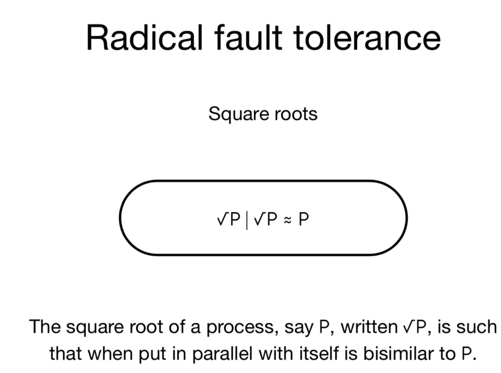
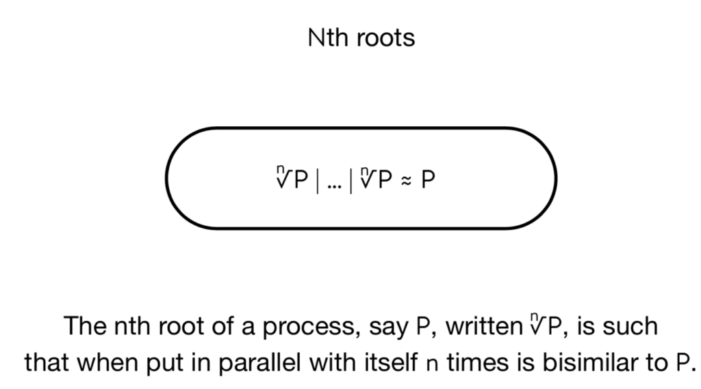
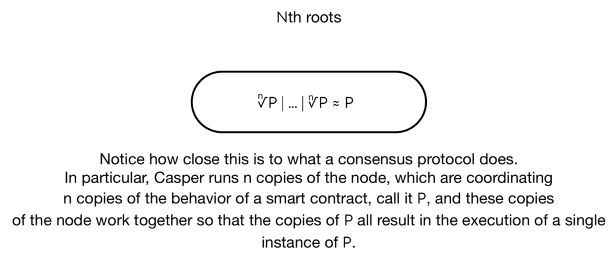
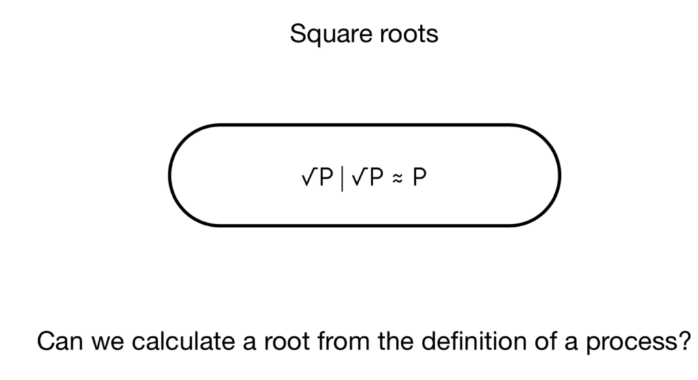
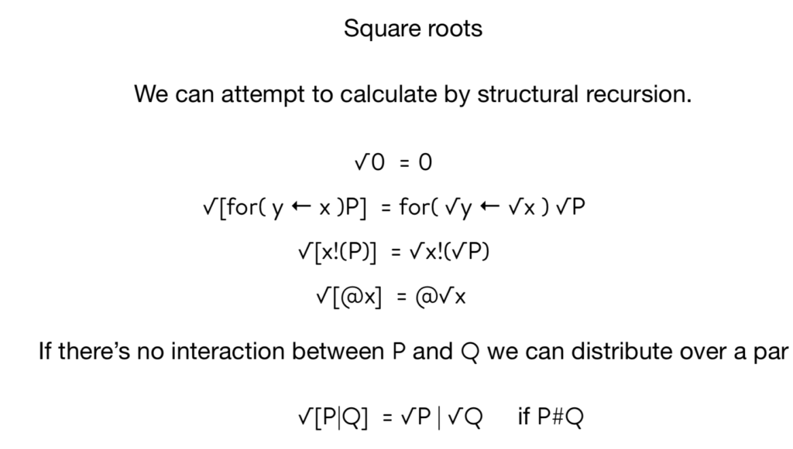
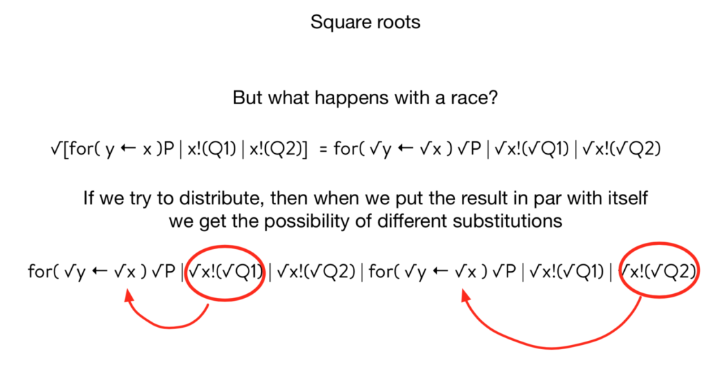
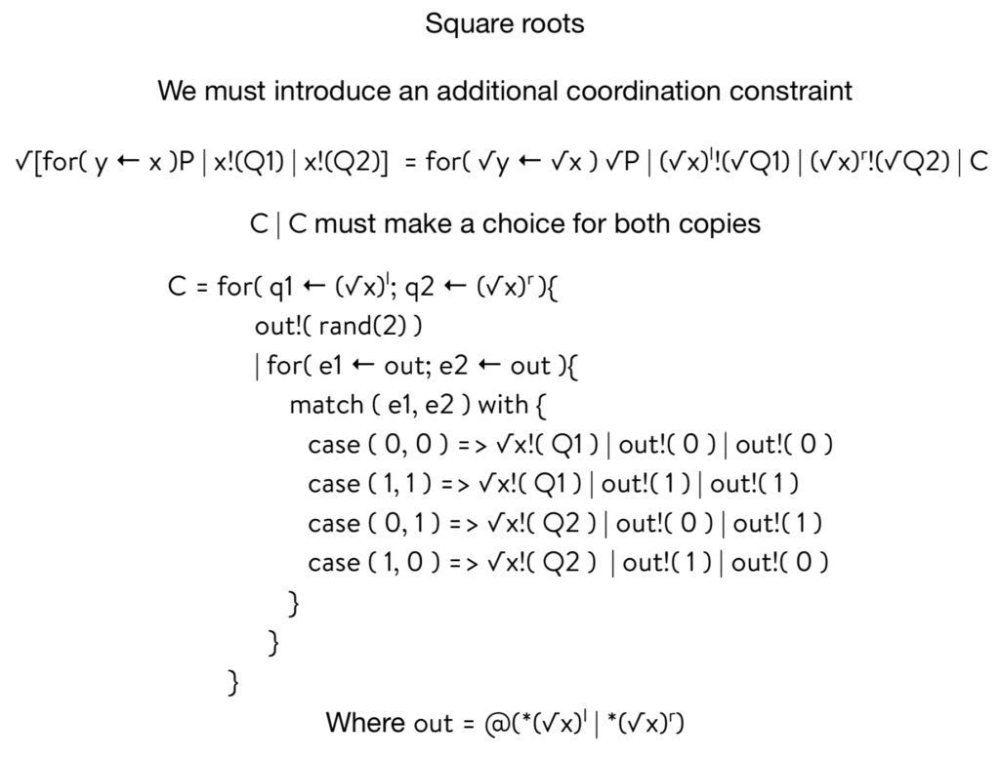
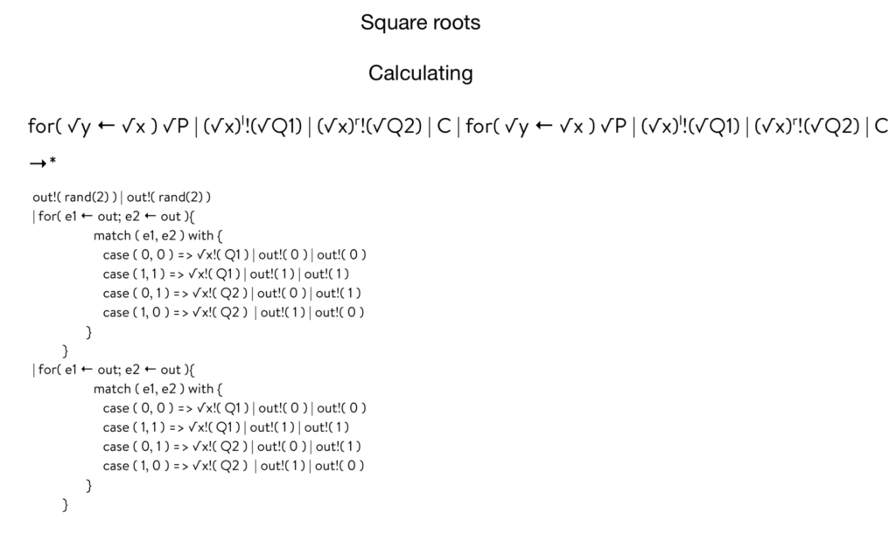
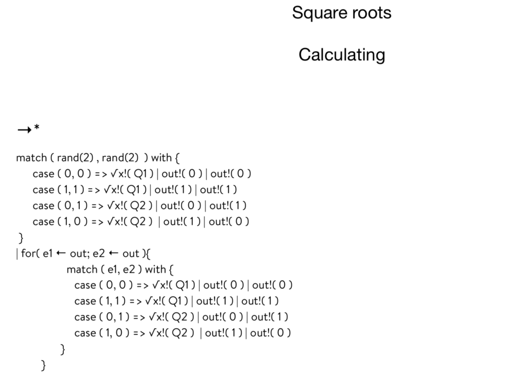
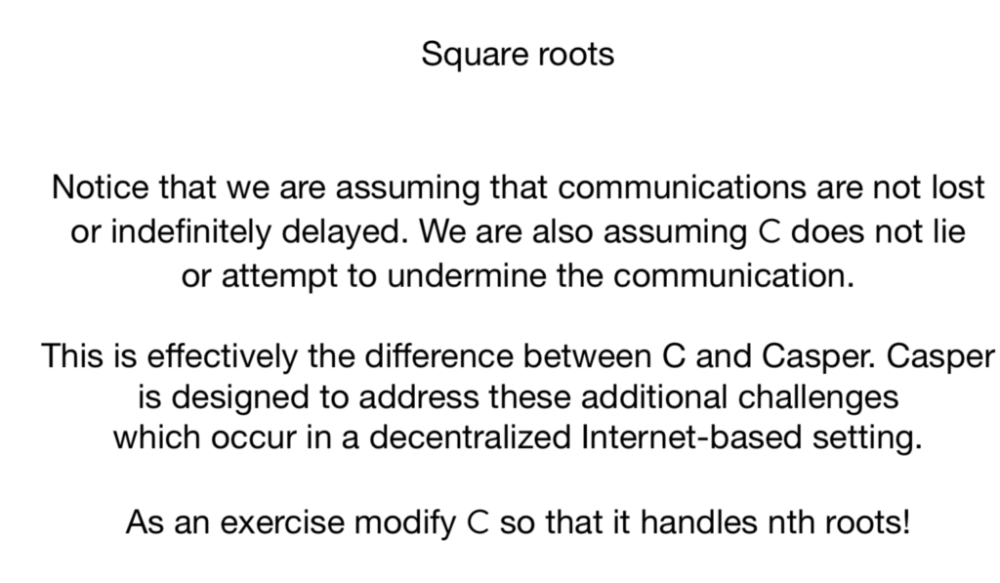

RCAST 38: RADICAL FAULT TOLERANCE

https://soundcloud.com/rchain-cooperative/rcast-38-radical-fault-tolerance

Greg Meredith discusses calculating the square root with Isaac DeFrain and Christian Williams.

### SLIDES

### TRANSCRIPT

Greg: The idea goes way back for me—about 17 years. I was hanging out in Harvard, waiting to chat with Walter Fontana and another process Algebraist, just who was interested in biology. To entertain myself, I was looking at analogs of arithmetic operators. It turns out that you can define an analog of the notion of square root. For the process calculi, there’s this notion of running processes in parallel. You have an equational notion of equivalence called bisimulation. You can ask the question: Is there a process square root of P such that square root of P par square root of P is bisimilar to P. You can give a crisp definition of this operation.

With pi, I was unable to come up with a calculation for the square root. If you turn to your calculator on your phone or laptop, you can press a button and it will calculate the square root of a number. The question is: Could you calculate the square root of a process?

All this was just good mathematical fun. I really didn’t think about it as having an import with respect to computation. It turns out it does. It’s easier to see if you consider nth roots rather than just square roots.

The generalization is fairly straightforward. The nth root of process P—written just nth root P—if you put N copies of the nth root P in parallel with each other, that’s bisimilar to P. You can see that this is starting to look remarkably like the kind of thing that we expect of Casper in RChain. We’re running N copies of the node and Casper is coordinating those copies so that the behavior of a single smart contract—in this case, this would be the role of P in the root calculation—only one copy of P gets run even though we have all these copies of these root processes running. It’s very similar to consensus. I didn’t say that very well, but let me check in with you guys. Does that make sense?

Christian: Yes. These end copies are supposed to represent the different choices that P could make in response to this consensus protocol. It’s averaging out the possible actions that P could have. Is that the point?

Greg: If you of the way that Casper works, it doesn’t work by averaging, it works by ensuring that all copies agree on the races. That’s really what’s going on. When we go further that we’ll see that that’s exactly what we do here.

Isaac: Something that wasn’t clear to me, that now is becoming more clear because of how you just explained it: We’re going to have however many nodes, say 10, running all of their own instances of these processes or smart contracts. Ultimately, we only want one of those to actually be executed. I didn’t see that connection between the square root and this coming to consensus on the state. But that illuminated that connection for me.

Greg: Yes, exactly. All the copies are running, but it’s as if only one P runs. There’s no one place where only P is running. As a harbinger of what we’ll discuss at the end, we need all N copies to run. We’re not asking for a quorum of them. That would be a relaxation of this idea or an enrichment of this idea in some sense.

Without loss of generality, I want to look at the calculation of just the square root. Once you see the solution, you can generalize it to get the nth root.

For the most part, you can distribute the calculation through. If you put zero in par with zero, that’s zero. The square root of zero is zero. I was having a conversation with a mathematician friend of mine yesterday. He was asking if there are any other fixed points for the operation. You can quickly see that if something is a fixed point, then it has to be bisimilar to Bang P. Because this square root of P is equal to P and the square root of P par P is also equal to the square root of P, so that means P par P is equal to P, which means an infinite number of them…

Isaac: It’s interesting too because the square root operator is operating on processes and names.

Greg: I couldn’t calculate it for Rho because I didn’t know how to calculate the square root of new. Whereas here, because names are just quoted processes, I just distribute.

Going through it more simply, when we take the square root of a for comprehension, we distribute the root all the way through everything. We’re going to take the square root of the continuation and we’re going to take the square root of the guard if the for comprehension is listening for Y from X, and we take the square root of X, but we also take a square root of the bound variable.

The reason we do that is because we’re also going to take the roots of any guards. If the guards are bound and then we do a root operation on them, then they would cease to be bound. But if we also do a root on the binding variable, then they remain bound.

Isaac: You’re attaching the square root to the continuation, so you would need to do something like that.

Greg: Yes, exactly. There’s one case that’s missing here is that the deref case; it distributes as well. It’s exactly the same.

Now the interesting thing is when you hit a par. The par you have to break up into two cases. If P and A are separated—there’s no interaction between them, so they share no free names, for example—then you can just distribute the operation so that the square root of P par Q is the square of P par the square root of Q.

But if they can talk to each other, you run into problems. We can try to distribute the operation through and see what happens. If you do distribute the operations through and you take the result of that and you put it in par with itself, then you see that there’s a race. In the slides, I’ve circled the race.

One side of the arc can get the substitution of Q1 for the square root of Y. The other one gets the square root of Q2 for the square root of Y. Now they think different things about the state.

This is directly drawing on the point that you made, Isaac, which is really interesting. We’re going to have to introduce some kind of constraint. It’s a coordination constraint process that we’ll put in par with the operation that distributes everything through. That immediately sets up an arithmetic constraint on C. It’s got to be the case that when you take C and you run it in par with itself, it makes the choice for both copies of the distribution of the root over the four.

That’s a nice little puzzle. It’s a different kind of choice in the way a choice usually works. We implement this in a cool way. It turns out that join and choice are interrelated. You can desugar join down to a choice. Here, we’re going the other way. We’re desugaring the choice down to a join.

Christian: What is the join?

Greg: The join is when in the for comprehension you’re listening on two different channels.

Christian: I see.

Greg: You can’t get through that guard unless you’ve got all of them,

Isaac: Consume two messages at once.

Greg: I’m using a notation that I developed in the original Rho calculus paper. It goes way back because it’s not my notation, but the superscript L and R are in-lefting and in-righting names. The set of names is infinite and you can create these bisections to sub-name spaces. You can do this in any number of ways.

You can take the name that you’ve got and put it in the output on one side and an input on the other. There’s an infinite number of ways you can do this, but just know that we’ve got these bijections to sub-namespaces. That’s what lefting and righting does.

Christian: This is a bijection between the set of processes and the set of processes unioned with itself.

Greg: It’s a bijection between the set of names and a subset of names. It’s like evens and odds. That’s the best way to think about it.

We don’t immediately output the choice between Q1 and Q2 over on X. Instead, we output Q1 on the left of the root of X and Q2 on the right of the root of X. Then C grabs the left one and the right one. Since we have two copies of C running in parallel, each copy will grab a Q1 and Q2. It doesn’t matter which one. They can grab its own or can grab the other for comprehension one. It doesn’t matter because each one will have exactly one Q1 and one Q2.

Christian: How are we getting two Cs in parallel?

Greg: The root of the for comprehension puts the thing to the right of the equal sign. When you put that in parallel with itself, you get two copies of C.

Isaac: I didn’t realize this before, but the reason you need that left and right superscript is so you don’t have a comm event on the level of just one of these square roots.

Greg: That’s correct. Each copy of C grabs one Q1 and one Q2. Both of them produce on a channel, which I’ve called out. Out is calculated from the root of X left and the root of X right, so we can calculate this channel. This is a channel that Cs will use to communicate internally with each other. You can arrange it so that out is fresh relative to the continuation or the Q1s or Q2s. I’ve given a simple definition here, but you can be more sophisticated in this regard to make sure that it’s fresh relative to those things.

They output a coin flip on the channel out. Notice that you’ve only got two copies of C and you only get two coin flips total. Each one is doing one coin flip. If you guard with a for comprehension that grabs both of them, the other one will be locked out.

This is effectively an implementation of leader election. That’s something to note about the power of the Rho calculus augmented with join. You can do leader election in one line.

Christian: What do you mean by leader election?

Greg: We’re going to insist that one of the Cs recognize the choice. It doesn’t matter which one. It’s not really a leader. There’s nothing special about which one goes first. At the end of the day, it’s like cars coming to a four-way stop sign. Who goes first? It doesn’t really matter. One of them has to break the tie. This is the tiebreaker.

That’s an important thing to observe about the expressiveness of the Rho calculus with join. We can do this in a single line.

Isaac: It’s almost like an anonymous leader.

Greg: Yes, that’s right. In that sense, the leader is anonymous. It still qualifies as a kind of leaderless distributed consensus algorithm. I’m borrowing terminology from a friend of mine, Steve Bures, that I worked with at Microsoft. He calls this case analysis beast or freak. You have two coin flips. From two coin flips you either get beasts, which is a head and tail, or you get freaks, which is the head and a head or a tail and a tail.

In both freak cases, we say that that selects Q1. Remember, we’re going to need to output two Q1s because each copy of the for needs the Q1. We output on the square root of XQ1. That unlocks one of the fors. Then we go ahead and we put back on the out channel, the coin flips that we got, which will unlock the other C, which will then open up the other Q1 one on the root of X and make the other for comprehension unlocked. Now we’re assured that both of them got the same value.

Christian: After that, that second one has these kinds of hanging extra outputs on out.

Greg: That’s just garbage. You can either get rid of it with garbage collection or ace it out. There are ways to get rid of the garbage. I just made it simple.

Christian: I’m interested in the fact that you’re using a random number generator—why it’s necessary. Is it bisimilar because you depend on the law of large numbers?

Greg: I thought long and hard about that particular shoot. The randomness is only putting the randomness of the non-determinism back in. Where we took the non-determinism out, and the randomness here, the coin flips are just putting that back in.

Isaac: It’s like getting a choice from a coin flip.

Greg: Yes, that’s exactly right. It’s not like root actually adds entropy. I thought, is root really adding entropy? And it’s not adding any more entropy than the original non-determinism.

Christian: This is something I always wondered about with process calculi and it’s just because I don’t know enough, but the decision on which communications happen, in practice, it isn’t literally random? It’s depending on a choice of implementation, in evaluation strategy.

Greg: No, it really is random. If you have different machines coming up with different configurations at different times you get different outcomes. Typically it’s interpreted as a race, but the race is going to be related to the entropy in the system. If you always have this kind of connectivity with one machine and this other kind of connectivity with the other machine, and if the configuration is completely determined, then the race will be completely determined. So the randomness goes out.

Isaac: The interpreter is not literally flipping a random number to see which winner of the race condition wins. It’s dependent on the state of the machine.

Greg: Yes, that’s exactly right. In the rest of the slides, I sketch out what I just said in English. There are a few subtleties. You have to watch out if the X was at a zero. There’s a corner case there that we might want to look at. In general, you want to look at the corner cases for all fixed points of groups. In terms of C it’s covered by the end left and end right. But there are some subtleties there worth taking a peek at so that people feel comfortable.

By and large, I’ve had it reviewed by several people and nobody’s been able to poke a hole in it. I feel pretty confident in these calculations.

If you look at Vlad’s argument for the safety of Casper, it’s not something that I can push through into Hall or Isabelle or something like that. There are a lot of moving parts and there’s some subtle reasoning. It’s not automated.

Here, I’ve tried to provide a specification of what I would call a toy leaderless distributed consensus algorithm, where the proof could be completely automated. That’s where we’d like to get to. We’d like to get to a version of the consensus algorithm where the proof of its correctness is mechanically checked. Or, if we can’t do that, know precisely what steps in the proof require subtlety, that requires humans as opposed to machines. We know where the risk is in terms of our understanding of the algorithm.

Christian: This stuff about Casper is probably clear to a lot of people listening, but I still honestly don’t know a whole lot about it. Could we go into a little more detail about how this is analogous to Casper?

Greg: I was going to do that next. I’m building up to that.

I’ve tried to make this as simple as something like the GCD algorithm, or Euclid’s proof that there are an infinite number of primes, or something really crisp and tight and simple that you could imagine automating the proof of and why that’s of a benefit to us. This little algorithm is not the same as Casper. There are some reasons.

The first and most obvious is that if you look at the way names work in the Rho calculus, unless you introduce a process that’s stealing communications and either boarding them off to other parties or dropping them on the floor, all channels are essentially perfect in the sense that no communications are lost nor are they infinitely delayed. Casper is formulated in a setting where it runs over the internet. So communications can get lost and potentially infinitely delayed.

Isaac: There are no faults in the calculus.

Greg: Well you can introduce them. You can model these by adding processes that steal messages off of channels. But you have to be explicit about it.

Christian: What does it mean to steal a message?

Greg: Let’s say that P is communicating with Q over X. Let’s introduce a process T for thief that also listens on X. Now T is racing with Q—let’s say Q is the recipient. T now races with Q. One of them will win. If T wins, then Q gets starved of that communication.

Christian: Why can’t that happen in the normal Rho calculus?

Greg: I have to explicitly introduce them. Whereas in the internet, I don’t think about it as explicitly introducing the thief process.

Isaac: There are physical connections that could be corrupt or lagging.

Greg: Yes, exactly. The flip side of it though is it causes me to be explicit about my fault model. In the Rho calculus, I’m going to have to say what constitutes a fault.

Christian: This is about the fact that the difference between the Rho calculus and the internet is that communication is intrinsic to the Rho calculus and the language itself rather than in the hardware. It’s a huge difference.

Greg: Interestingly though, I would argue that if you look at physics or biology, communication is intrinsic. The internet is simulating something that is already the case in the real world.

The other thing is that C doesn’t lie. C is a really stupid process, but you could imagine that there’s a variant of C which goes the other way with respect to the beast or freak casing. Let’s call it C prime. If you run C in parallel with C prime, the network will get screwed up because one side may think that you chose Q1 and the other side thinks you chose Q2.

That’s the equivalent of equivocation in Casper, which is a slashing offense. Casper is dealing with detecting line. On top of that, Casper is providing an economic organization of the protocol so that agents which are providing an implementation of Cs are economically motivated to have them do the right thing. In particular, the whole staking mechanism and the block fees end up providing a good incentive mechanism so that people don’t right lying Cs.

Finally, notice that you need both copies of C in order for this to work. But Casper says that we only need a quorum of Cs. There’s a little bit of a misleading sense in the title of the talk. I call it “Radical Fault Tolerance.” It’s a bit of a pun because radical is root. The root of root is radical.

Christian: You’ve gotten good at these titles.

Greg: It’s not actually fault-tolerant in the sense that if we shoot one of the Cs in the head, it makes P more fault-tolerant, but not super more fault-tolerant. You distribute the roots around, so there isn’t one physical location where P lives. That’s good. But you haven’t actually made that fault-tolerant in the sense that if you shoot one of those roots in the head, it can’t proceed. It’ll get stuck somewhere.

Isaac: You only have N minus 1 nth roots, you’re not going to reproduce the process that you wanted.

Greg: That’s exactly right. In order to make this more fault-tolerant or provide a richer notion of fault tolerance, we would have to offer a notion of quorum. We’d have to build in some redundancy here.

Of the ones that we’ve talked about, most of them are very approachable with this methodology. The one that’s the furthest down is economics. Introducing economics at this level is a lot trickier. However, one way to think about it would be to go after a reaction rate-based solution, some kind of stochastic solution. That still doesn’t quite address incentives. There’s still a gap to be crossed. By and large, this is a very promising direction of research. At a minimum, it allows us to see Casper more clearly. We can see what it does and what it doesn’t do.

Christian: In terms of economic incentives, do you see this meshing well with the presentations you gave of the metabolic interpretation?

Greg: Yes, that’s exactly right. This is a deep topic. I’d like to write some kind of—I don’t know what the right form is, maybe a book—that goes over the history of agency. There are several different notions of computational agency that have been put forward and they all have different qualities or aspects.

It’s weird the way these different notions of agency have lined up with history. It’s extremely strange for Aristotle to come up with his notion of logical agency that essentially prefigures computers as opposed to the sort of agency you find in linear logic, which happens two millennia later better matches the kinds of machines that they were using in Aristotle’s age.

When you use a catapult, you know you’ve got the pile of rocks next to you. When you use up that pile of rocks, you know you don’t have any more rocks. You can’t proceed with the attack. Same with a quiver of arrows.

Those kinds of machines are all resource-sensitive. You’d think that the notion of agency that Aristotle comes up with doesn’t have this weird digital, “I can make infinite copies” kind of underpinnings, but that’s exactly what happens in Aristotelian logic. It’s got infinite copies laying around. That’s very strange. Why didn’t Aristotle come up with linear logic instead of classical logic?

Isaac: Are you suggesting there should be some constraints on the N of the nth roots? You shouldn’t be able to produce this as arbitrarily many copies?

Greg: No, I was trying to go for a different point. I wanted to observe that economic agency is a very strange form of agency. There isn’t a notion of economics in nature. There’s survival. There are evolutionary imperatives. But there isn’t money. You can’t get money out of the ground as a natural resource. You can’t get money by growing it. The only place you can get money is from other human beings. Economic agency is a very subtle, strange kind of agency.

Capturing economic agency is a really interesting idea. If you look at the economics literature, and there are lots of proposals that are built around assumptions about economic agency, but a lot of those assumptions about economic agency have turned out to be bogus.

I’d really like to capture economic agency as a computational phenomenon: here’s a model of computation that crisply characterizes economic agency and then when we test it against how humans behave in economic situations, it captures a range of behaviors. Does that make sense?

Christian: I think so.

Isaac: I also tend to think that it makes sense, but I’m a little bit unclear as to exactly what you mean by “economic agency.” Could you explain that again?

Greg: Clearly nature has resource-bounded computation. I don’t think that would be a lot of argument on that point. Economic agency is a special form of resource-bounded action where there are incentives as a part of the agents that are acting that come into play. In ordinary economics, we assume rational agents that are trying to maximize profits, which is very far from what happens in the marketplace.

Capturing that sense of incentivization and resource bound, I’d like to understand that a lot better and I’d like to understand it as a computational model. My feeling is that the tools of compositionality, completeness, resource-bounded, concurrency, and bisimulation, those tools make it possible to go after such a model in a way that hasn’t been attempted before.

To the best of my knowledge, there is not one instance of a bisimulation-style proof in the economic literature, even though the notion of bisimulation is actually hundreds of years old. It’s been rediscovered over and over and over again. Its significance as an exceptionally powerful mathematical tool wasn’t understood until David Park saw it and then Robin Milner picked it up.

Those tools give us a fighting chance to capture a notion of economic agency. Then we could use that notion of economic agency in this style which I’ve presented this proof. We inject the economic agency into a model like this. Because we’ve characterized it in terms of bisimulation and these other things, then we can potentially automate the proof.

Christian: I have a lot of questions, but I was wondering if briefly we could bring it back down to basics and talk about how this is analogous to Casper. Right now it’s not even clear to me why splitting up a process into N processes is a form of consensus. It’s deciding race conditions in some way, but I’m not sure how this is what we want by consensus.

Greg: What Casper is doing—let’s think about a running network. We have N different nodes. A user of the network comes along and deploys an instance of a smart contract. What happens in RChain is that that deployment will get picked up by all of the validators. In that sense, there are N copies of that deployment of that smart contract. So that I can reduce the number of words I have to say, I’m just going to call that deployment instance P. Now we have N copies of P running.

If N copies of P all ran independently, then if P had any non-determinism in it whatsoever, then there would be a problem because one of those copies might go one way and the other go another. Casper is functioning in the role of the Cs in our root calculation. Whatever the non-determinism is, they all agree on that non-deterministic choice. Essentially, for RChain, Casper serves in the role of making sure that the winners of all races are agreed by all parties. That’s where we use the consensus.

Christian: It sounds like this should lend itself to proofs—that everything happens perfectly in this form of consensus.

Greg: That’s right. By “perfectly,” it doesn’t mean that P is without bugs. It just means that whatever the bugs are, they’re manifest on all the nodes in the same way.

I was working for a large software company that wanted to do a knockoff of Mathematica. The definition of “done” was “bug compatible.” “Bug for bug.” If you’re trying to take over a market, it actually makes sense.

Isaac: I guess that that is something to consider.

Greg: I was just playing around with Christian’s use of “working perfectly.” It won’t work perfectly, but when it’s working, we’ll agree that all parties agree on exactly what the behavior is.

Isaac: Regardless of if there’s a bug in the underlying process or not.

Greg: That’s right.

Isaac: I have a question about taking square roots with race conditions. We did this case and the generalization of the nth root is more or less straightforward. You can follow your nose and figure that out. What I don’t see as being clear: here we have two sends that are competing for one receive. What if the situation is we have three sends that are competing for one receive?

Greg: I was hoping somebody would ask that. That also turns out to be a straightforward generalization. The two generalizations are the same. When you do the root calculation you’re not just doing it on single races. You’re looking for what I call tangles. A tangle is where you have N parties contending on a channel.

Isaac: When you’re grouping all the pars so you can take this square root appropriately, you’re grouping them in terms of these tangles.

Greg: That’s exactly right.

Christian: This includes not just N outputs but N inputs at the same time.

Greg: That’s right. There are only two forms of races, and that’s either two outputs/one input or two inputs/one output. It turns out that those two can be collapsed in one. They’re inter-definable. Follow your nose.

Isaac: This is a tangle in the sense of that really cool presentation you gave at one of the Ethereum conferences.

Greg: That’s precisely it.

Christian: Could we have a podcast about that?

Greg: Sure.

Isaac: Oh, yeah. Or could we talk about Knots As Processes? I saw your paper about it. I haven’t gotten around to reading it yet, but I really would like to.

Greg: I’d love to do that. The Knots As Process idea is a lot of fun.

Isaac: Are those the same thing?

Greg: They’re related. But the visualization that I gave at the Ethereum conference is the most obvious visualization. All you have to do is take the syntax tree and draw the lines on the history of the use of a channel through the syntax tree. That’s how you get those things.

It’s definitely worth talking about because the visualization is powerful and that was my point. Even with the most obvious visualizations, they’re so powerful. That means the underlying calculus has a lot of expressive power.

We can talk about either one of those. If you want to talk about the Knots As Processes, I can bring my collaborator, David Snyder. He’s gotten more interested in RChain recently. He would enjoy a chance to talk with us.

Isaac: That’d be great.

Greg: The reason I did that goes back to this point that we were discussing earlier about the power of bisimulation. If you look at the literature, a lot of people—for example, Maurice Hurley—took the extremely powerful tools of Algebraic topology and applied them to concurrency theory and got some nice results. I felt that the direction was wrong, or at least only half the story is being told.

For the last 200 years, computation has been the errand boy for mathematics. I believe that the next 200 years are going to be turning this around, so the mathematics begins to learn a lot from computation. In particular, bisimulation is one of those things. It’s a really powerful proof technique. I wanted to provide a pathway whereby Algebraic topologies could get a flavor or taste of what a bisimulation proof looks like and where it might be applicable.

With the Knots As Processes, it was really a throwaway kind of idea where—it was already known since the sixties that ambient isotropy is a computable problem. People use rewrite systems to show that that was decidable. It wasn’t like it was some groundbreaking result in that sense.

The theorem that we proved is that two knots or ambient isotopic, which is the notion of equivalence in knot theory, if and only if their representations as processes are weakly bisimilar. The interesting thing is that when you start mixing in LADL with this idea, as long as you preserve this property that P and Q are bisimilar if and only if they satisfy exactly the same set of formulae, now you can use formulae as a query language or classification language on knots. That is very interesting. The best classification language or notation language was Conway’s notation, but that only covers rational knots. This covers everything.

Isaac: That’s the value of recasting certain notions like that. You have all of these tools that seem to separate from a certain area of study. Now all of a sudden become available and start giving you new directions of investigation and maybe even new results for free, which is great.

Greg: I’m totally with you. I wish I had infinite research funds and 34 hours in the day. Art Is Long. Life is short.
