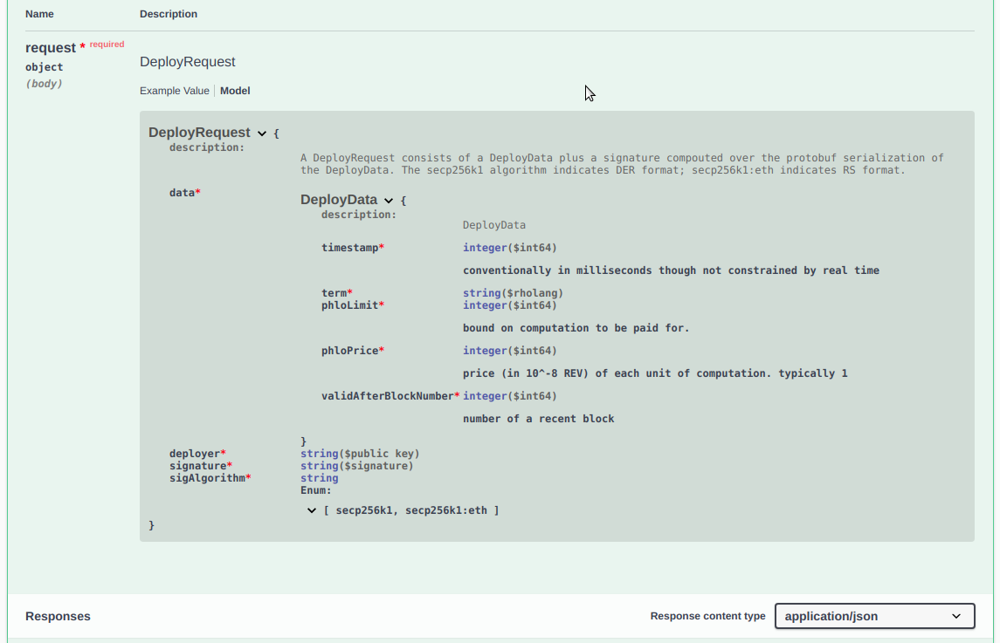

The core team is working on [web api documentation · Issue \#2974](https://github.com/rchain/rchain/issues/2974). So I drafted [rnode-openapi.json](https://raw.githubusercontent.com/dckc/rchain/rnode-openapi/docs/rnode-api/rnode-openapi.json). Put that in the [Swagger UI](https://petstore.swagger.io/) and you can explore the API in detail:

You can even run rholang examples using exploratory deploy:

And get the results:

