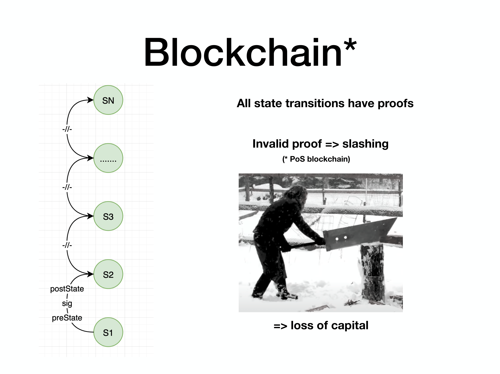
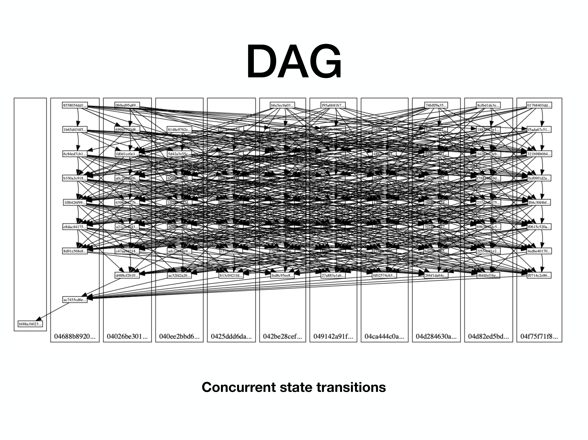
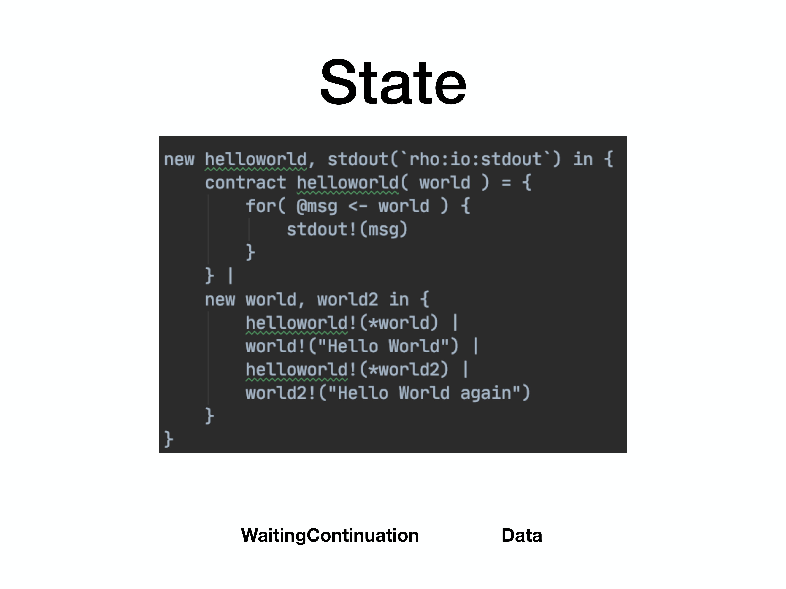
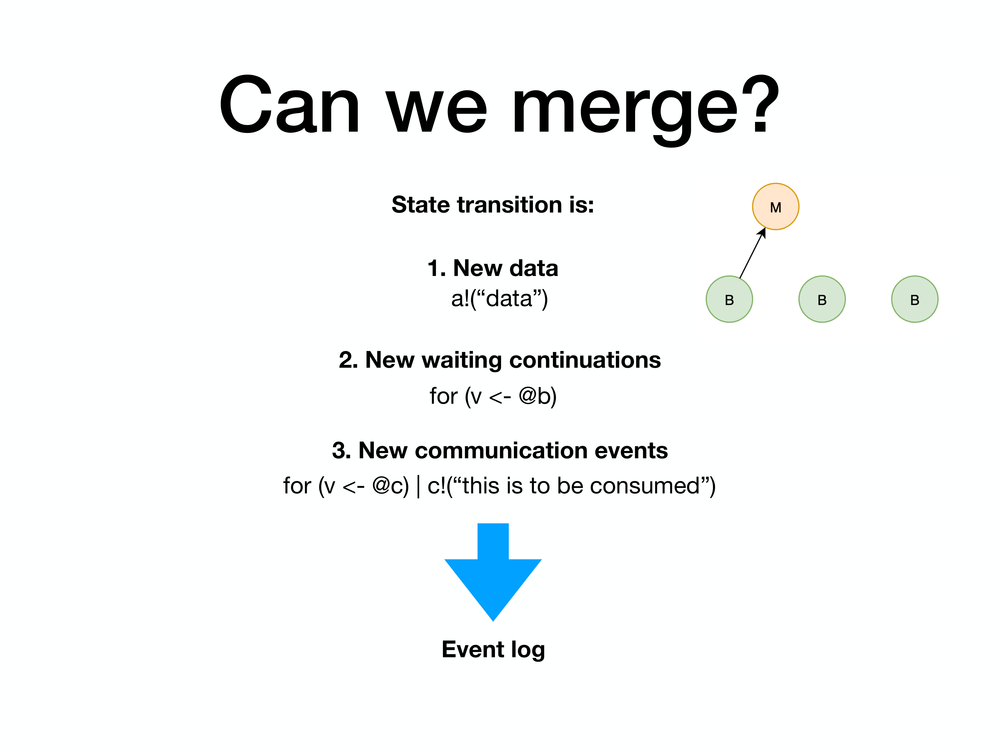
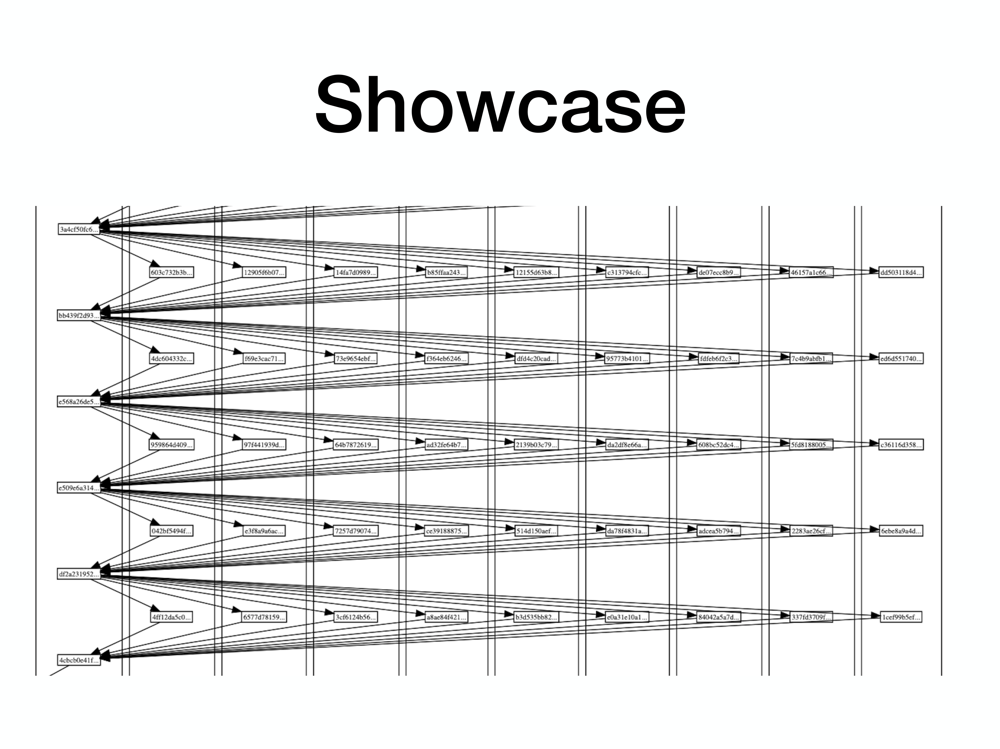

This article aims to explain how RChain can reach horizontal scalability, targeting one of the key ingredients of RChain platform - block merge.
Some preliminary results of implementation analysis are included in the end.

Blockchain is effectively a computer, replicated across a number of nodes.
Two basic offerings are cryptographic proof of state transition + economic incentive for making sure one cheating is going to be punished.

**_
This article is targeting the first part of the equation - state transition.
_**

Early incarnation of blockchain application as cryptocurrencies gave birth to a notion of public ledger. This public ledger contains, in the simplest case, a list of balances. But just a list is not a good model for such a ledger, so usually more sophisticated models are used, like [UTXO](https://en.wikipedia.org/wiki/Unspent_transaction_output) for Bitcoin and some others.

Ethereum developed a state model ([EVM](https://ethereum.org/en/developers/docs/evm/)) that allows storing turing complete state machines, thus enabling executing arbitrary smart contracts.

Entities that are allowed to introduce changes to the state, changing balances, making transactions, invoking smart contracts - are miners, or validators of the network.
In case of PoS networks, once some state change is introduced, it should be verified by other validators, and the Sword of Damocles should punish thee daring cheating (or, in simple words, the cheater will lose its stake).

This is the basic principle of most chains.

**_
But what if some miners of the network make two state transitions at the same time?
_**

[PoW](https://en.wikipedia.org/wiki/Proof_of_work) systems solve this by the longest chain rule - state transitions are stacked upon each other in order at which miners produce proof of work, and in the end the longest chain wins. There can be, and will be orphans, so miners doing useless work is a part of the protocol. [PoS](https://en.wikipedia.org/wiki/Proof_of_stake) chains mostly suggest slots for blocks, and the more stake miner has the more blocks it is allowed to create, thus collecting more rewards.

As it can be seen, this basic principle of a blockchain assumes that all state transitions happen one by one, and verified one by one. This leads to seeking scaling opportunities in running parallel chains or making some computations off chain and committing the result of a batch at once.
Why is this, one might ask? Why not have a nice graph, or hypergraph, or hypergraph of hypergraphs? And include all state transitions that have been done by all validators, eliminating orphans at all?

Here's the problem - when some miner creates a new state transition (new block), it has to use some state as a base to work with, some state that has been already proven by the network to be valid. (e.g. one that says that the author of the article owns all BTCs). And if you have not a chain, but DAG (directed acyclic graph), you have several possible base states to work with. Let us have 4 validators proposed 4 blocks with the following transactions:

`tx1: Alice bought a toy train` 
`tx2: Bob bought a ticket to the cinema` 
`tx3: Carol bought the same toy train that Alice did` 
`tx4: Dave moved all his funds to DeFi contract with open exploit`

Ok, so miner A sees all these transitions and tries to create a new state transition, willing to have all these 4 changes included into the final state which it will offer to peers for verification.
Here the question arises - how miner A can be sure that tx1 tx2 tx3 and tx4 do not call a double spend (and here tx1 and tx3 actually call a double spend)? RChain stands on a point that if you don't have a computational model that has an intrinsic concurrency model - you cannot detect that double spend. Of course, one is able to create some extensions over the smart contracting language to track some special cases, e.g. have some very strict model for token transfers and check if token transfers do not interfere. But - this is a not scalable solution and quite fast stack up limitations. Also, it's an error prone because no one guarantees that this will be a secure solution.

**_
And here is what block merge does in RChain.
_** Thanks to [rho-calculus](https://en.wikipedia.org/wiki/Rho_calculus) as the foundation for computing language (Rholang) - conflict detection is provided straight out of the box. So miner A easily can detect which state transitions cannot be combined and disqualify such, so mark `tx3` as conflicting and removed from the state it is about to create. Then Carol can check the on-chain state and see that her transaction has been rejected and she has to resubmit it. Worth mentioning, that this conflict resolution happens not on block level - but on user deploys level. To understand this more deeply, let's take a look how RChain represents the state of a virtual machine.

All computations in Rholang are expressed as sends and receives on some channel, as it is a process calculi language. So, roughly speaking, all that is stored - is data pieces that are available on a channel, and continuations that are available on a channel (this is basically code that waits to be executed once data comes in). If at some point data and continuation match - comm event happens, which is a basic compute event. All this beauty is stored in a RSpace - a flavour of [Gelernter’s tuple space](https://en.wikipedia.org/wiki/Tuple_space), which is a storage unit. As a side note, the outcome of this storage model is that RChain offers **_transactional data storage_**.

There is one basic constraint on a RSpace - if one looks at it, there should not be any possible comm events at any time. When some state transition happens, if any comm occurs - all continuations are invoked till the point when RSpace does not have any more potential comm's left. That's why, if miner A sees `tx1`, `tx2`, `tx3` and `tx4`, the logic of conflict detection simply boils down to checking if changes produced by these transactions, added to RSpace, lead to potential comm events. If no - changes made by these tx’s can be put into RSpace without any code execution. And, which is important - this conflict resolution is built-in on a computational model level. So it is available for all user code ever going to be written, and - with mathematical proof of correctness.

**_
Now, having this knowledge, let's talk about how this brings scalability.
_**
General understanding in blockchain space is that if you add more nodes to the network - you inevitably lower down the throughput, decentralization is not free.
This sounds reasonable, overhead on routing and data replication increases. But, if miners are allowed to change state in parallel, and there is a way to validate and compose these changes in an efficient way - we might reconsider this statement. So, we have two pieces that have to be enabled to make this happen: efficient validation, and efficient merging of state changes. The latter includes conflict detection and actual technical merging of changes.

The great thing about RChain - validation for all state transitions can happen concurrently. RSpace is an immutable structure, it is never changed, data is only added. So, when miner A receives several blocks from miners B, C, D - all these state transitions can be validated in parallel (even if they are conflicting). In extreme cases - time spent on validation of 100 blocks should be the same as for a single block. But this is a matter of optimization, proper engineering and resources available. At the moment of writing the article this is still work in progress.

Conflict detection can be done with several degrees of efficiency, trading number of conflicts for performance. The most performant way is to not analyze the content of the channel but just detect if the same channel used with different polarities in two state transitions - on one data is being put into channel, in another continuation is being put into the same channel. In general case, this should not be a common thing, because of how channels are constructed using unforgeable names (which btw enables other awesome things like [object capability security discipline](https://en.wikipedia.org/wiki/Object-capability_model). So it is sufficient for many (if not the most) use cases. In this case conflict detection boils down to the operation of finding the intersection of two sets. This is quite a simplistic explanation, but for one's wanting to get a more in-depth picture, feel free to join Discord and ask questions.

And, the last part is the merging of state changes. This operation requires data that is inside quite a narrow scope till the last finalized block, which allows aggressive caching. But even without it, it's just reading from and writing to the database.

To sum up everything being said, this article briefly explained what is `block merge` and how it is related to scalability.
As said in the beginning of the article, some preliminary results can be found in this [gist](https://gist.github.com/nzpr/2465db5210c817324ab7ab4f01e23f38).
The DAG below is being built, with synchrony constraint set to upper bound, so validator have to wait for all others before creating block.

The expected result which should demonstrate linear scalability is that merging time is a linear function of number of nodes and number of blocks created by the network grows linearly with increasing number of nodes.

As it can be seen, merging of state changes for 20 blocks takes about twice as for 10 blocks. Which gives some high hopes for achieving almost linear scalability for state merging.
**_
Please stay tuned for next articles with more data and tests. Thank you for reading this! Come join and ask questions http://discord.gg/NWkQnfH
 _**
