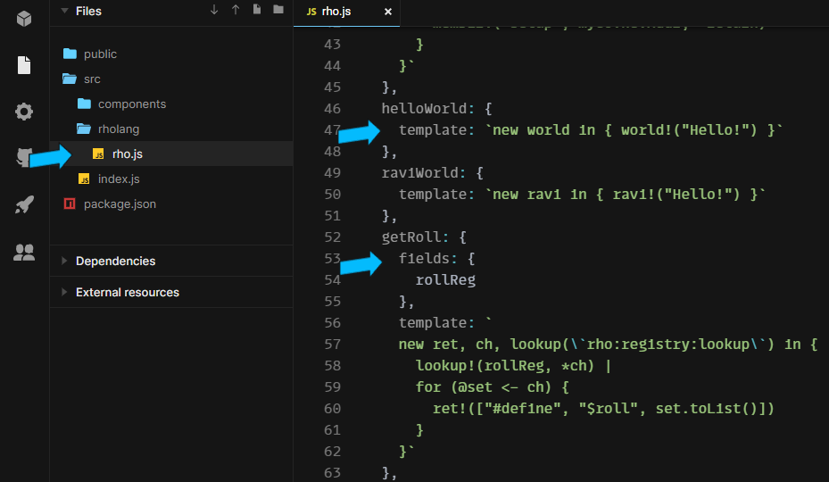
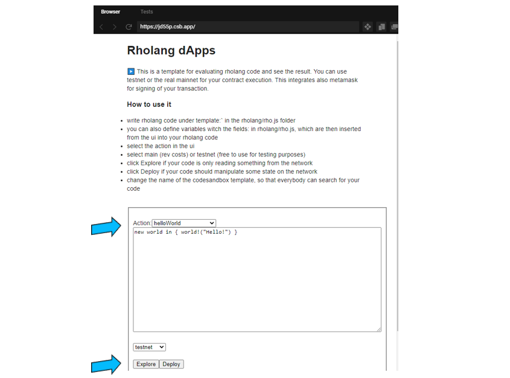
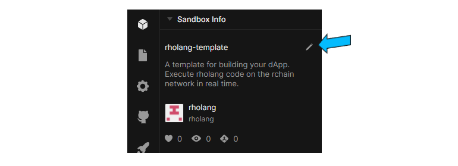
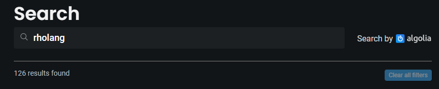

# Evaluate rholang code online

This tutorial should help you to build Dapps by your own and deploy them to the network with the use of Codesandbox.io. Use this [codesandbox template](https://codesandbox.io/s/rholang-template-jd55p?file=/src/rholang/rho.js) to start.

Codesandbox.io advantages for your Dapp development:

- free to use for everybody
- no login required
- evaluate your rholang code (read only) for free on the rchain testnet
- evaluate your rholang code (rev cost) on the rchain mainnet

## Write rholang code

The language in which you write your Dapp ist rholang, which is beeing executed decentralized on the rchain network.

1. Go to codesandbox.io and use the [rholang template](https://codesandbox.io/s/rholang-template-jd55p?file=/src/rholang/rho.js)
1. Under the folder rholang, select the rho.js file
1. Insert your rholang code after the key 'template:'
   1. If you have variables, which you want to fill from an ui and should be inserted into the rholang code, write this variable after the key 'fileds:'

## Execute your rholang code on the rchain network

To execute you rholang code on the rchain network you can run choose between _testnet_ or _mainnet_:

After that you can use _Explore_ or _Deploy_.

_Explore_ runs your code on the network (on a read only node). You can deploy a contract which is reading some state of a contract on the network. This execution is free to use.

_Deploy_ runs your code on the network and mutates the state of some contract. This execution costs rev (use metamask for signing the transaction).

The returned result will be displayed after the execution in the ui.

## Make your code searchable for others

To let others discover your rholang code, please edit the title of your codesandbox.

> ⚠️ your title of the sandbox has to beginn with: rholang-  
> example title: rholang-helloworld, rholang-liquid-democracy ...  
> otherwise your sandbox will not be found by codesandbox by others.

With this your codesandbox is searchable under the search query: rholang

see here: [search rholang dapps](https://codesandbox.io/search?refinementList%5Btags%5D=&refinementList%5Bnpm_dependencies.dependency%5D=&page=1&configure%5BhitsPerPage%5D=12&query=rholang%20)

