# Build DApps

DApps are a growing oppurtunity for disrupting decentralized applications. With this tutorial you learn to create a wallet and get free testnet tokens.

## Create a wallet

1. To use the rchain network you need to have a wallet. Open this [rnode-client](https://tgrospic.github.io/rnode-client-js/) page from the rchain community. There you can create a new wallet. The code to this wallet is [open-source](https://github.com/tgrospic/rnode-client-js).

2. Change the network to testnet. The testnet is for testing puposes only.

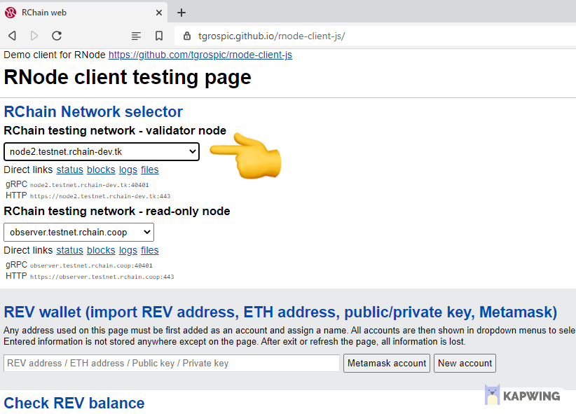

3.  Click on new account and type a name (here Account) in the field. Then click _Save account_.

    > ⚠️ Save your private key, public key, ETH key, REV key somewhere else!

    > ⚠️ Never share your private key with somebody else!

    > ⚠️ The REV key is like an ethereum address you can share.

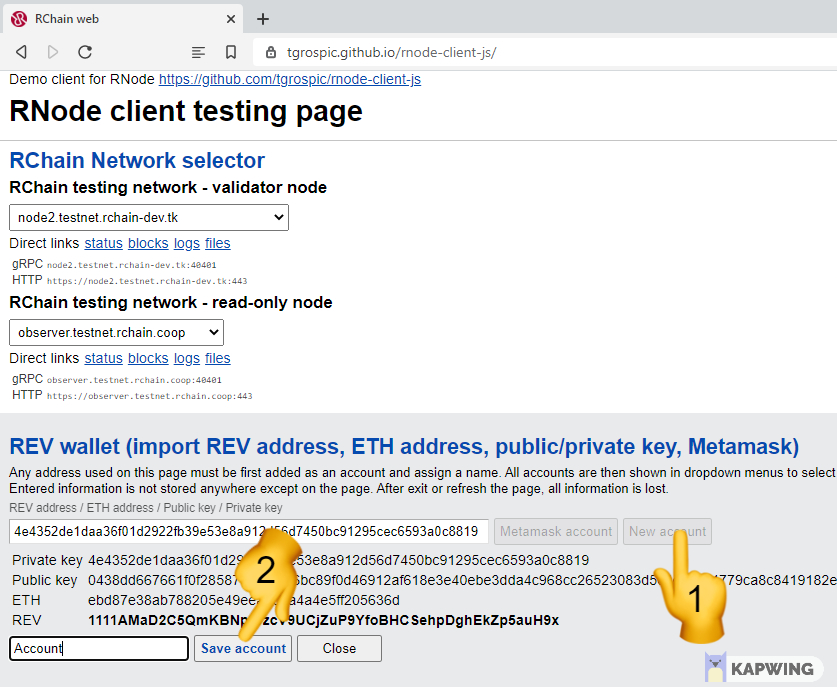

4. You can get free TestRevs for making test transactions or deploying a smart contract on the testnet. Go to the page: [Testnet token](https://status.rchain.coop/testnet/faucet/)
5. Put your Rev address in the field and submit.

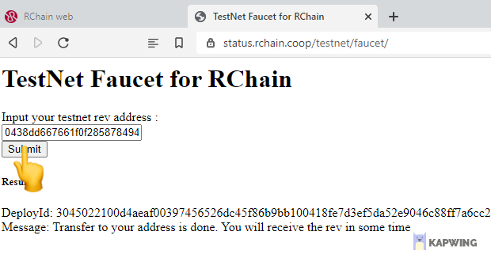

5. After some time you can click _Check balance_ and there should be 100 TestRev tokens in your account.

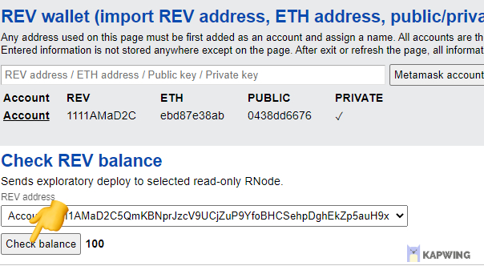

6. If you want to transfer you token to anouther account, type an amount into the field and click transfer.

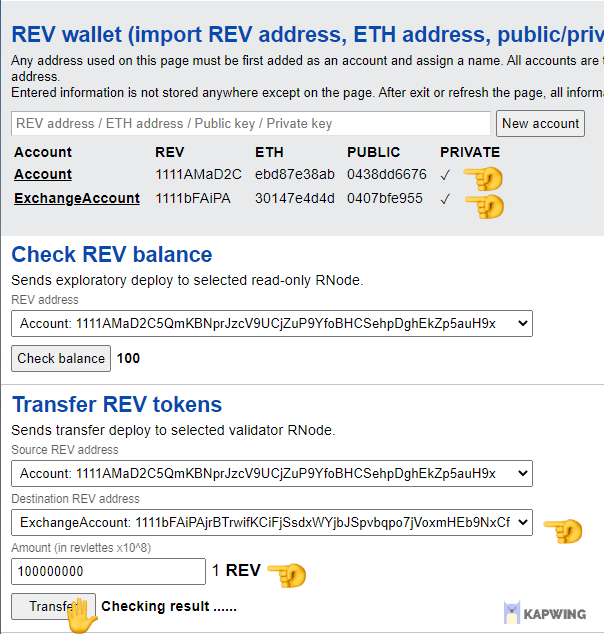

## Use your wallet with metamask

To protect your private key, you can use metamask.

Supported ways:

- Import with your private key
- Connect a hardware wallet

1. Install metamask for chrome/firefox.

   > ⚠️ If you are in incognito mode in chrome you have to enable the metamask plugin for incognito mode. Otherwise there is no metamask icon shown up on the top right.

2. Click on import account.

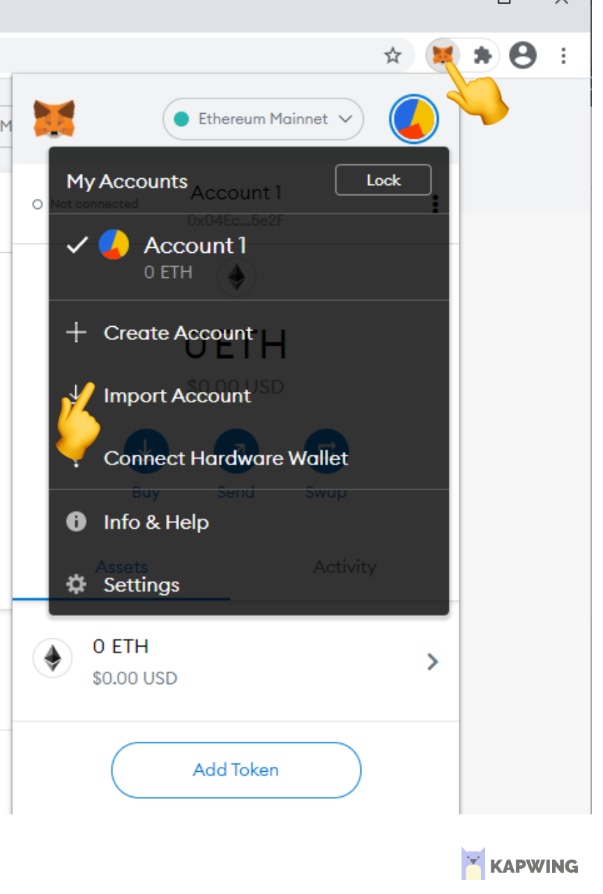

3. Insert your private key and click import.

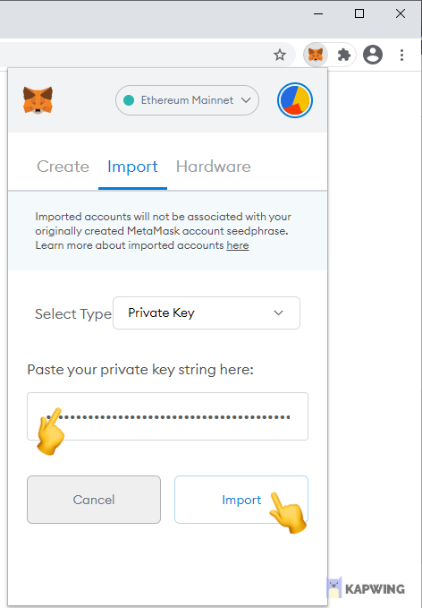

4. Click on the page on _Metamask account_. Metamask opens and you have to select your account. Then click _next_ and then _Connect_.

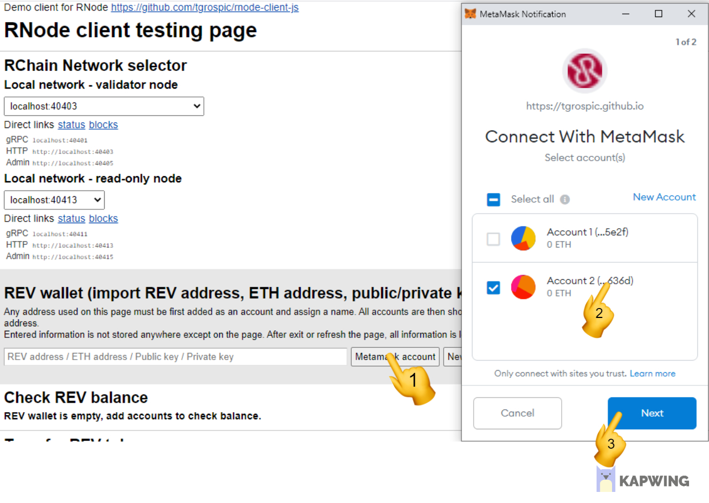

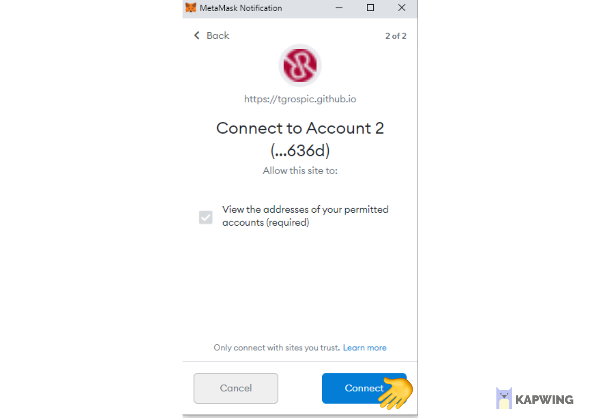

5. Type a name (here Account) into the field and click _Save account_

   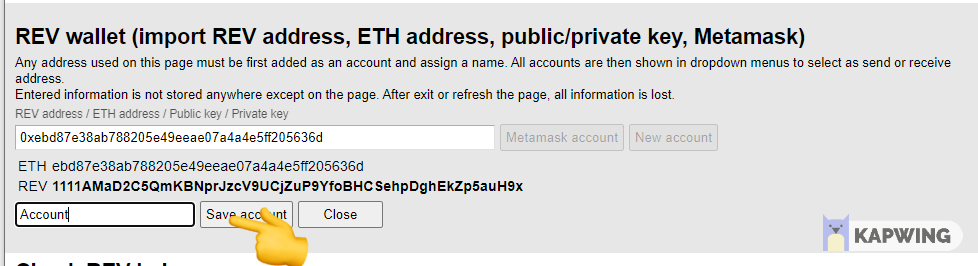

## Use your wallet with brave browser

1. Load the page and click _Start Crypto Wallets and reload_.

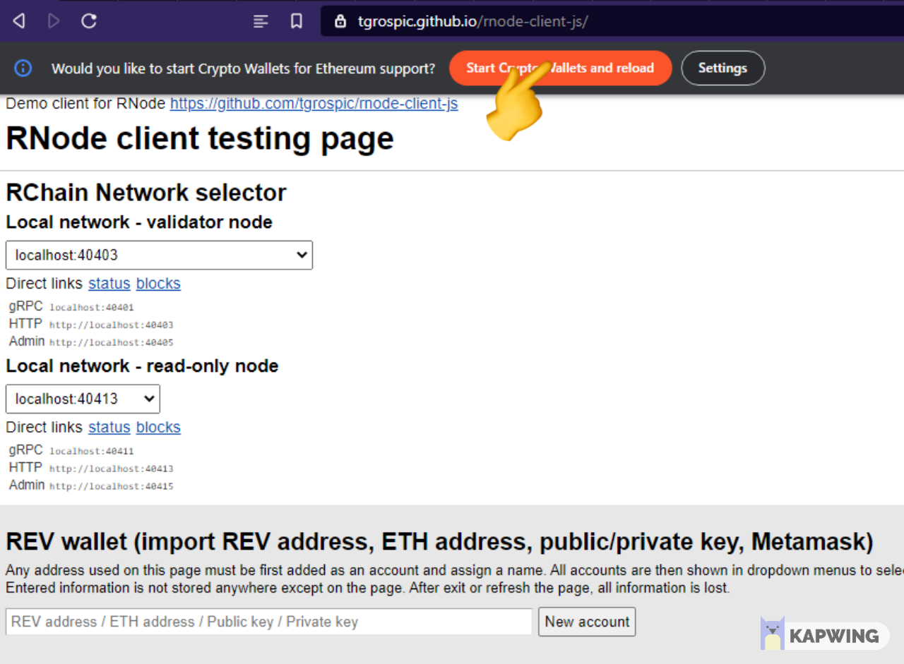

2. Import your private key in the brave crypto wallet like with metamask. Select the account you want to use.

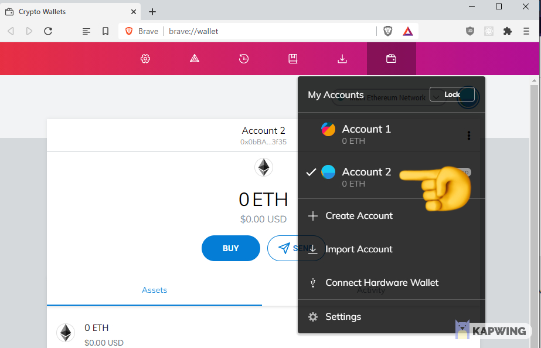

3. Follow the same steps as with connecting with metamask.
