# Rholang SDK usage

This chapter describes how you can use the rholang-sdk as a template for your web dApp. It includes:

- Rholang bundler (rholang to js/ts bundler)
- A testing framework based on jest for evaluating your deploys.
- All need libraries for interacting with the rchain network (locally/testnet/mainnet) are included.
- A frontend app, which is a nft template web application written in typescript and executed on vercel.com (static site).
- Interaction with the metamask plugin and the nft template web app.
- Cloudflare workers for caching rholang exploratory deploys from the rchain network.

## Installing the SDK

The SDK works with Windows, Linux, Mac. This tutorial describes the setup process for windows.

**Prerequisites:**

- Windows 10, Linux, Mac
- [Node.js 16](https://nodejs.org/dist/v16.6.1/node-v16.6.1-x64.msi)

**Optional, but recommended:**  
Local rnode (docker) instance. Look [here](/dapps/setup-docker/), how to do it.

1. Download the [nft-template](https://github.com/rholang/nft) ➜ For that go into vscode and there click on View ➜ Command Palette
   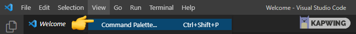
2. Then type in: git clone.  
   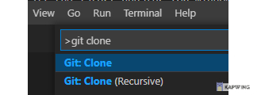

   If there is not git clone to select, you have to install [Git SCM](https://git-scm.com/downloads) on your pc .
   Click on git clone and type in:

   ```javascript
   https://github.com/rholang/nft.git
   ```

   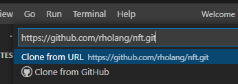  
   Select the folder you want to download the files. After it has downloaded the repo, click on the button **Open** on the right bottom in vscode.

3. Open a terminal in vscode (Terminal ➜ New Terminal). Then open a Command Prompt (not powershell)
   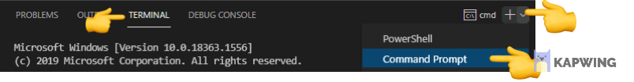

4. Install **pnpm** globally (like yarn, but faster, better workspaces support). For that type the following into the command prompt:

```javascript
  $ npm install -g pnpm
```

> ⚠️ If you get the following error in your console:  
> **Error**: cannot be loaded because running scripts is disabled on this system.  
> **Solution**: use in vscode the command prompt instead of powershell.

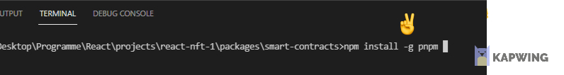

5. After that, type into the vscode terminal:

```javascript
  $ pnpm install
```

6. After all project dependencies are installed, go under packages/smart-contracts/src/rholang. Here are the rholang smart contract files stored. You can write additional rholang code at this place.  
   If you want to insert a **external javascript variable**, then type "rho:arg:&lt;variable name&gt;". E.g "rho:arg:account" .
   This contract can then later be called from javascript with checkBalance({account:"0x1223232"}).

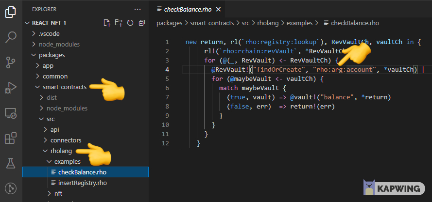

7. Bundle your .rho files into javascript/typescript files. Type into the console:

```javascript
  $ pnpm build:w
```

> ⚠️ If you get the following error in your console:  
> **Error**: replaceall is not a function  
> **Solution**: update your nodejs to version 16

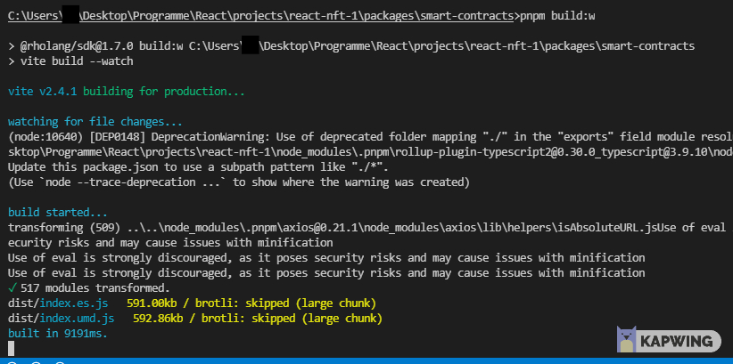
This will build the @rholang/sdk package with watch-mode. It is also generating type informations for importing this into your frontend app. If you change your .rho file and save it, then it will automatically generate a new js/ts output in the dist folder.

## Testing rholang code

1. Start up your local rnode (docker) instance. [Setup local rnode (docker)](/dapps/setup-docker/)
2. Install the following vscode extensions: **Rholang, Jest, Test Explorer UI, Jest Test Explorer, Vite**.
3. Go to the test file (here index.test.ts in the packages/app/\_\_tests\_\_ folder).  
   The generated rholang files can be imported with import {...} from "@rholang/sdk"
   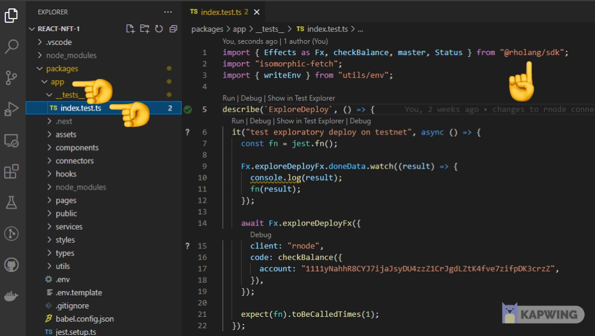

4. If you have the vscode extensions installed, you can see on the left sidebar a test logo (1). Click on it.  
   You can then click on the test case in the ui (2) or open the test file and click on Run

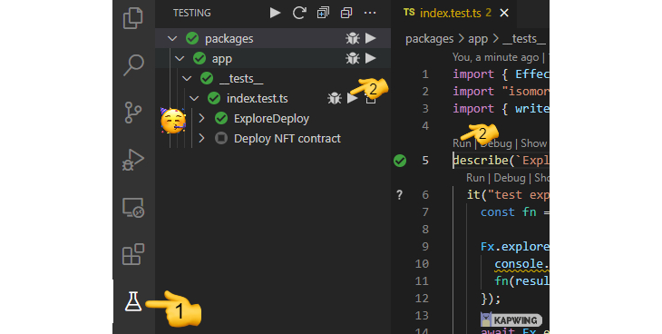

> ⚠️ If you get the following problems:  
> **Error**: Test Explorer UI extension is not showing any tests and run/debug is not available if you open index.test.ts.  
> **Solution**: restart vscode. If there is on the right bottom a notification with: "This workspace contains a Typescript version ..." then click on the **Allow** button.

4. Open the vscode terminal and go to jest (vite-demo) output. You can see the result of the exploratory-deploy or deploy of the rholang code from the local rnode instance.
   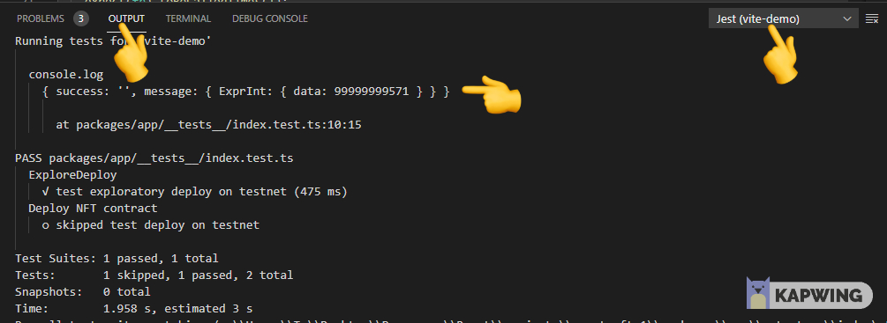

## Executing the NFT template app

1. in the vscode terminal type:

```javascript
 $ pnpm run dev
```

2. open the link to localhost:3000 in the browser.

## Publish the site to vercel.com

Vercel.com lets you create a free static site, where you get a free subdomain.

1. Create an account at vercel.com
2. Clone the [nft-template](https://github.com/rholang/nft) to your own github repository.
3. Create a new project at vercel.com and import your repository.
4. Go to settings of your project and change it to the following:
   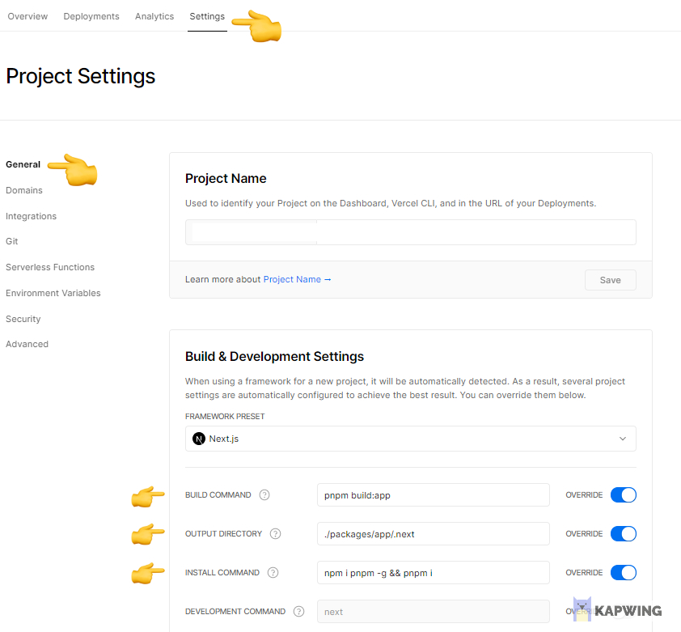
   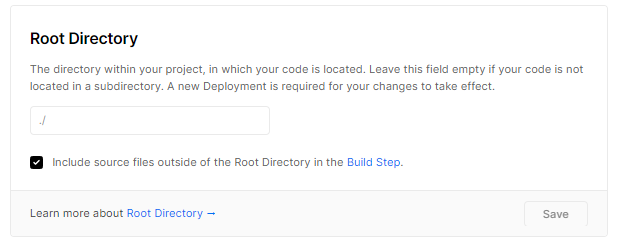
5. If you make a pull request to your repository, then there is an automatic rebuild of the site.

## Using Cloudflare workers with rnode and your webApp

Cloudflare workers lets you deploy serverless code, which can be used for small code execution. Together with cloudlflare workers key-value store one can use it for having a very fast response time, when thousands of user are doing exploratory-deploys on the Rchain network.

The repository for the cloudflare worker is [here](https://github.com/rholang/cloudflare-nft). But you can just use the existing one by making a request to https://worker-typescript-template.nftland.workers.dev or import the functions Fx.exploreDeployFx from the @rholang/connectors library.

**Advantages**:

- Free to use
- Ddos protection
- 100.000 free request per month, 1GB key-value store are free
- < 60 ms response time
- caching of your explore-deploys

### Concept

When the first user visits the website, then explore-deploys are send to the cloudflare worker. Every explore-deploy to the cloudlfare worker is stored in their key-value store. If this request was never fetched, then for the first time it will send a request to the rchain network. The response is cached. When a second user is requesting the same explore-deploy rholang code, then cloudlflare is sending the cached response back, which is very fast. When some smart-contract has changed on the rchain network (deploy), then the rnode instance will send to the cloudlflare-worker a notice, that the cache is not up-to-date anymore.

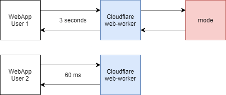
