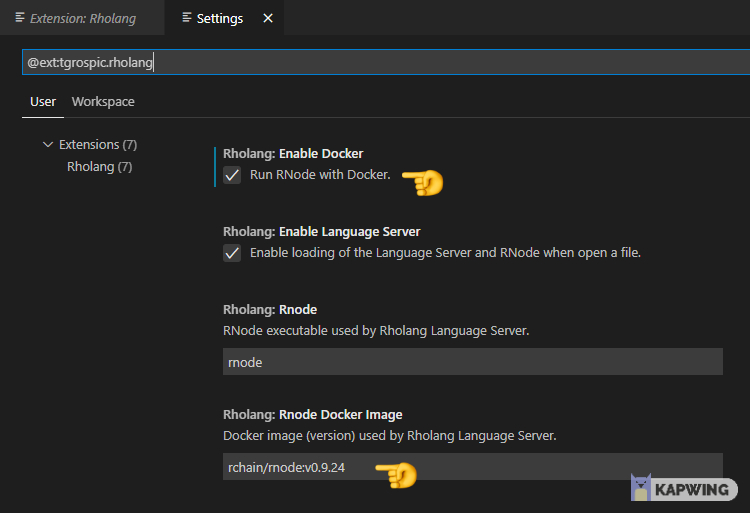
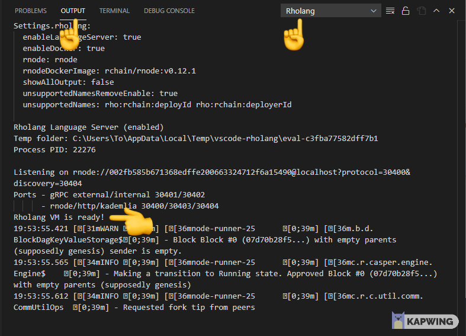
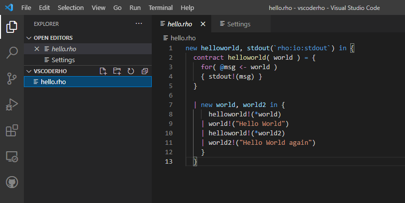
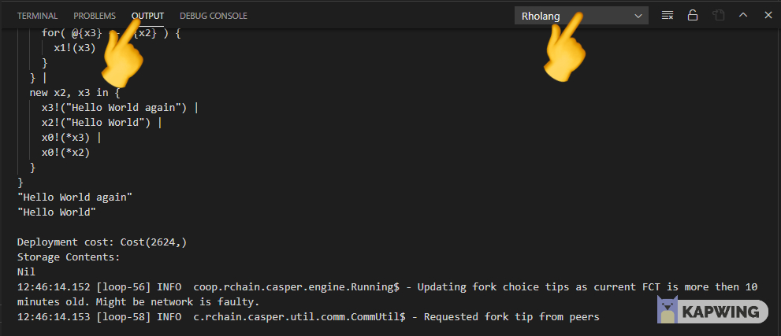

# Evaluate rholang code offline

The evaluation of rholang code is done on a rnode client. This tutorial explains how to setup everything to run rholang code in VSCode with the use of a rholang [extension](https://marketplace.visualstudio.com/vscode)

## Install the rholang extension in VSCode

The VSCode extension runs with Windows, Linux, Mac. This tutorial describes the installing process for windows.

**Prerequisites:**
Windows 10

1. Install the latest updates for windows 10 and install the latest version of [docker](https://hub.docker.com/editions/community/docker-ce-desktop-windows/). Click on **Get Docker** and install it on your pc. Restart the pc.
2. After restart run the Docker Desktop application.
3. There has to be a **white** docker logo on the windows taskbar.
   If the docker logo ist red, then there is a docker problem with your pc (sometimes wsl_update_x64.msi has to be additionally installed).
   

4. Install the VSCode extension for rholang. Search for the rholang extension, install it and then got to setting for this extension.
   

5. The checkbox for Enable Docker and the Rnode Docker Image (rchain/rnode:v0.12.1) has to be set.
   
6. Open to the command line in vscode and to the OUTPUT tab. Then select rholang on the dropdown menu on the right. Wait for a minute until there is the output **Rholang VM is ready!**.
   

7. Create a new file with the .rho extension. And write some rholang code:

   ```javascript{numberLines: true}
   new helloworld, stdout(`rho:io:stdout`) in {
   contract helloworld( world ) = {
      for( @msg <- world )
      { stdout!(msg) }
   }

   | new world, world2 in {
         helloworld!(*world)
      | world!("Hello World")
      | helloworld!(*world2)
      | world2!("Hello World again")
      }
   }
   ```

   

8. Save the hello.rho file with strg+s. After every save the rholang file is evaluated on the rnode instance in docker.

9. Open a terminal in VSCode, go to OUTPUT and select Rholang in the navbar. The evaluated result of the code in this example is: "Hello World again"
   "Hello World".

   

   > ⚠️ If you get the following errors in your console:  
   > _docker: Error response from daemon: open \\.\pipe\docker_engine_linux_ or  
   > _docker: Error response from daemon: status code not OK but 500:_ then wait and restart vscode again.
