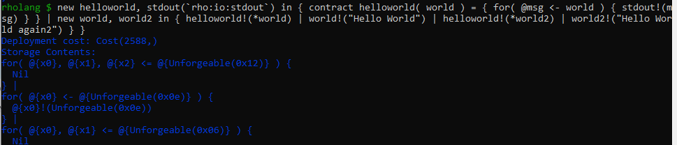
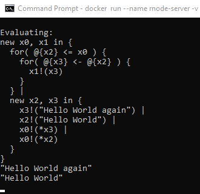

# Rholang

Rholang is a new programming language designed for use in distributed systems. This document describes the syntax in Rholang.

Rholang is "process-oriented": all computation is done by means of message passing. Messages are passed on "channels", which are rather like message queues; however, the channels behave more like bags (multisets) rather than queues, since there is no implicit ordering on messages.

Rholang is completely asynchronous, in the sense that while you can read a message from a channel and then do something with it, you can't send a message and then do something once it has been received, at least, not without explicitly waiting for an acknowledgment message from the receiver. Every channel has a name, and every name denotes a unique channel.

**Rholang language specification:**

[Language specification 0.2](./pdf/rholang-spec-0.2.pdf)

[Language specification 1.1](./pdf/rholang-spec-1.1.pdf)

## Rchain Cloud

Evaluate Rholang code in the cloud and test your dapp [Rchain Cloud](https://rchain-community.github.io/rgov/).
## VSCode Plugin

This is the Visual Studio Code extension for the Rholang programming language. It has support for syntax highlighting and code evaluation with error highlighting.
[Marketplace VSCode](https://marketplace.visualstudio.com/items?itemName=tgrospic.rholang)

## Local Node

Another way to run rholang code is to start up your own local RNode and use its rholang interpreter. For that rnode has to be installed. There are two modes to run rholang code locally: repl and eval. With repl you can type rholang code directly into the console and execute it. With eval you are running a .rho file and execute this file. Try the [localhost development environment](https://docs.google.com/document/d/1V5k9tDjztEVDYiXJG1-Hpb0rNtVcV22GrsdXb0pDUx8).

##### 1. REPL

the following chapter provides you with the information for setting up REPL with docker for windows. If you don't want to use docker or windows, this is also possible and you just have to change the commands slidely.

##### 1.1 Requirements

- Requirements: Windows 10 or Linux
- Docker installed

##### 1.1 Setting up docker

- after installing docker for windows -> start Docker Desktop -> on the right bottom there is a small icon, if docker has started
- download genesis folder from [genesis folder](https://github.com/rchain-community/rchain-docker-shard/tree/master/genesis)
- create a folder (e.g on desktop -> C:/Users/Nakamoto/Rnode/)
- copy genesis folder from download (unzip) into rnode folder (e.g C:/Users/Nakamoto/Rnode/genesis)
- open command line
  - cmd1: `$ docker pull rchain/rnode:latest`

##### 1.2 Commands for running repl

- cmd1:`$ docker run --rm --name rnode-server -v C:\Users\Nakamoto\Rnode\:/var/lib/rnode --network host rchain/rnode:latest run -s`

  - if the mount path is right and the genesis folder is there, then there is no error

- wait until it says:

  - 11:59:00.474 [INFO ][node-runner-21 ] [c.r.c.e.CasperLaunch$$anon$1 ] - Checking pendant hashes: 0 items in CasperBuffer.

- open a second command line:
- cmd2: `docker run --rm --name rnode-repl-client --network host -it rchain/rnode:latest --grpc-port 40402 repl`
- past rholang code into it:

  ```javascript
  new helloworld, stdout(`rho:io:stdout`) in { contract helloworld( world ) = { for( @msg <- world ) { stdout!(msg) } } | new world, world2 in { helloworld!(*world) | world!("Hello World") | helloworld!(*world2) | world2!("Hello World again") } }
  ```

  

* go to cmd1 -> there you can see the evaluation result ("Hello World again" "Hello World"):

  
